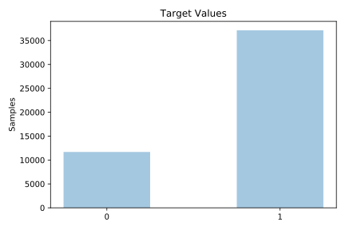

# adult

[Metadata](metadata.yaml) | [Summary Statistics](summary_stats.csv)

## Summary

**task**: classification

**instances**: 48842

**features**: 14

**number of classes**: 14

## Summary Plots

## Data Summary

|	variable	|	count	|	mean	|	std	|	min	|	25%	|	50%	|	75%	|	max|
| --- | --- | --- | --- | --- | --- | --- | --- | --- |
|	age	|	48842	|	38	|	13	|	17	|	28	|	37	|	48	|	90
|	workclass	|	48842	|	3	|	1	|	0	|	4	|	4	|	4	|	8
|	fnlwgt	|	48842	|	189664	|	105604	|	12285	|	117550	|	178144	|	237642	|	1490400
|	education	|	48842	|	10	|	3	|	0	|	9	|	11	|	12	|	15
|	education-num	|	48842	|	10	|	2	|	1	|	9	|	10	|	12	|	16
|	marital-status	|	48842	|	2	|	1	|	0	|	2	|	2	|	4	|	6
|	occupation	|	48842	|	6	|	4	|	0	|	3	|	7	|	10	|	14
|	relationship	|	48842	|	1	|	1	|	0	|	0	|	1	|	3	|	5
|	race	|	48842	|	3	|	0	|	0	|	4	|	4	|	4	|	4
|	sex	|	48842	|	0	|	0	|	0	|	0	|	1	|	1	|	1
|	capital-gain	|	48842	|	1079	|	7452	|	0	|	0	|	0	|	0	|	99999
|	capital-loss	|	48842	|	87	|	403	|	0	|	0	|	0	|	0	|	4356
|	hours-per-week	|	48842	|	40	|	12	|	1	|	40	|	40	|	45	|	99
|	native-country	|	48842	|	36	|	7	|	0	|	39	|	39	|	39	|	41
|	target	|	48842	|	0	|	0	|	0	|	1	|	1	|	1	|	1
