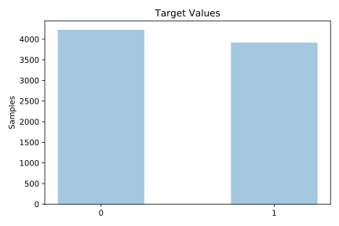

# agaricus_lepiota

[Metadata](metadata.yaml) | [Summary Statistics](summary_stats.csv)

## Summary

**task**: classification

**instances**: 8145

**features**: 22

**number of classes**: 22

## Summary Plots

## Data Summary

|	variable	|	count	|	mean	|	std	|	min	|	25%	|	50%	|	75%	|	max|
| --- | --- | --- | --- | --- | --- | --- | --- | --- |
|	cap-shape	|	8145	|	3	|	1	|	0	|	2	|	3	|	5	|	5
|	cap-surface	|	8145	|	1	|	1	|	0	|	0	|	2	|	3	|	3
|	cap-color	|	8145	|	4	|	2	|	0	|	3	|	4	|	8	|	9
|	bruises?	|	8145	|	0	|	0	|	0	|	0	|	0	|	1	|	1
|	odor	|	8145	|	4	|	2	|	0	|	2	|	5	|	5	|	8
|	gill-attachment	|	8145	|	0	|	0	|	0	|	1	|	1	|	1	|	1
|	gill-spacing	|	8145	|	0	|	0	|	0	|	0	|	0	|	0	|	1
|	gill-size	|	8145	|	0	|	0	|	0	|	0	|	0	|	1	|	1
|	gill-color	|	8145	|	4	|	3	|	0	|	2	|	5	|	7	|	11
|	stalk-shape	|	8145	|	0	|	0	|	0	|	0	|	1	|	1	|	1
|	stalk-root	|	8145	|	1	|	1	|	0	|	0	|	1	|	1	|	4
|	stalk-surface-above-ring	|	8145	|	1	|	0	|	0	|	1	|	2	|	2	|	3
|	stalk-surface-below-ring	|	8145	|	1	|	0	|	0	|	1	|	2	|	2	|	3
|	stalk-color-above-ring	|	8145	|	5	|	1	|	0	|	6	|	7	|	7	|	8
|	stalk-color-below-ring	|	8145	|	5	|	1	|	0	|	6	|	7	|	7	|	8
|	veil-type	|	8145	|	0	|	0	|	0	|	0	|	0	|	0	|	0
|	veil-color	|	8145	|	1	|	0	|	0	|	2	|	2	|	2	|	3
|	ring-number	|	8145	|	1	|	0	|	0	|	1	|	1	|	1	|	2
|	ring-type	|	8145	|	2	|	1	|	0	|	0	|	2	|	4	|	4
|	spore-print-color	|	8145	|	3	|	2	|	0	|	2	|	3	|	7	|	8
|	population	|	8145	|	3	|	1	|	0	|	3	|	4	|	4	|	5
|	habitat	|	8145	|	1	|	1	|	0	|	0	|	1	|	2	|	6
|	target	|	8145	|	0	|	0	|	0	|	0	|	0	|	1	|	1
