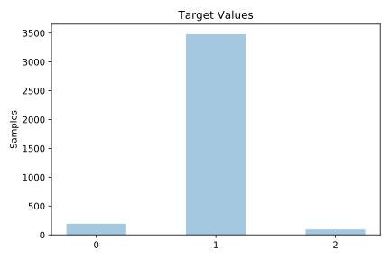
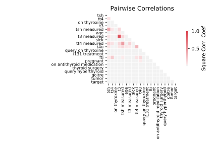

# allhypo

[Metadata](metadata.yaml) | [Summary Statistics](summary_stats.csv)

## Summary

**task**: classification

**instances**: 3770

**features**: 29

**number of classes**: 29

## Summary Plots

## Data Summary

|	variable	|	count	|	mean	|	std	|	min	|	25%	|	50%	|	75%	|	max|
| --- | --- | --- | --- | --- | --- | --- | --- | --- |
|	age	|	3770	|	46	|	20	|	0	|	28	|	49	|	63	|	93
|	sex	|	3770	|	1	|	0	|	0	|	1	|	1	|	2	|	2
|	on thyroxine	|	3770	|	0	|	0	|	0	|	0	|	0	|	0	|	1
|	query on thyroxine	|	3770	|	0	|	0	|	0	|	0	|	0	|	0	|	1
|	on antithyroid medication	|	3770	|	0	|	0	|	0	|	0	|	0	|	0	|	1
|	sick	|	3770	|	0	|	0	|	0	|	0	|	0	|	0	|	1
|	pregnant	|	3770	|	0	|	0	|	0	|	0	|	0	|	0	|	1
|	thyroid surgery	|	3770	|	0	|	0	|	0	|	0	|	0	|	0	|	1
|	I131 treatment	|	3770	|	0	|	0	|	0	|	0	|	0	|	0	|	1
|	query hypothyroid	|	3770	|	0	|	0	|	0	|	0	|	0	|	0	|	1
|	query hyperthyroid	|	3770	|	0	|	0	|	0	|	0	|	0	|	0	|	1
|	lithium	|	3770	|	0	|	0	|	0	|	0	|	0	|	0	|	1
|	goitre	|	3770	|	0	|	0	|	0	|	0	|	0	|	0	|	1
|	tumor	|	3770	|	0	|	0	|	0	|	0	|	0	|	0	|	1
|	hypopituitary	|	3770	|	0	|	0	|	0	|	0	|	0	|	0	|	1
|	psych	|	3770	|	0	|	0	|	0	|	0	|	0	|	0	|	1
|	TSH measured	|	3770	|	0	|	0	|	0	|	1	|	1	|	1	|	1
|	TSH	|	3770	|	126	|	83	|	0	|	65	|	113	|	174	|	287
|	T3 measured	|	3770	|	0	|	0	|	0	|	1	|	1	|	1	|	1
|	T3	|	3770	|	31	|	20	|	0	|	18	|	24	|	34	|	69
|	TT4 measured	|	3770	|	0	|	0	|	0	|	1	|	1	|	1	|	1
|	TT4	|	3770	|	121	|	98	|	0	|	23	|	84	|	226	|	241
|	T4U measured	|	3770	|	0	|	0	|	0	|	1	|	1	|	1	|	1
|	T4U	|	3770	|	66	|	32	|	0	|	46	|	58	|	72	|	146
|	FTI measured	|	3770	|	0	|	0	|	0	|	1	|	1	|	1	|	1
|	FTI	|	3770	|	110	|	97	|	0	|	17	|	58	|	224	|	234
|	TBG measured	|	3770	|	0	|	0	|	0	|	0	|	0	|	0	|	0
|	TBG	|	3770	|	0	|	0	|	0	|	0	|	0	|	0	|	0
|	referral source	|	3770	|	3	|	1	|	0	|	3	|	4	|	4	|	4
|	target	|	3770	|	0	|	0	|	0	|	1	|	1	|	1	|	2
