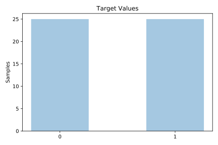
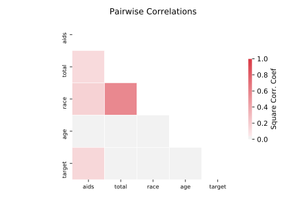

# analcatdata_aids

[Metadata](metadata.yaml) | [Summary Statistics](summary_stats.csv)

## Summary

**task**: classification

**instances**: 50

**features**: 4

**number of classes**: 4

## Summary Plots

## Data Summary

|	variable	|	count	|	mean	|	std	|	min	|	25%	|	50%	|	75%	|	max|
| --- | --- | --- | --- | --- | --- | --- | --- | --- |
|	Age	|	50	|	2	|	1	|	0	|	1	|	2	|	3	|	4
|	Race	|	50	|	2	|	1	|	0	|	1	|	2	|	3	|	4
|	AIDS	|	50	|	9037	|	16823	|	3	|	114	|	1640	|	9073	|	82334
|	Total	|	50	|	4423370	|	6371785	|	162616	|	702786	|	1616417	|	2806359	|	22686934
|	target	|	50	|	0	|	0	|	0	|	0	|	0	|	1	|	1
