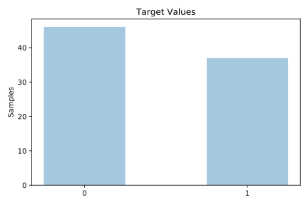
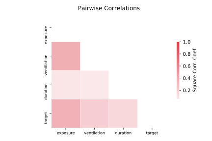

# analcatdata_asbestos

[Metadata](metadata.yaml) | [Summary Statistics](summary_stats.csv)

## Summary

**task**: classification

**instances**: 83

**features**: 3

**number of classes**: 3

## Summary Plots

## Data Summary

|	variable	|	count	|	mean	|	std	|	min	|	25%	|	50%	|	75%	|	max|
| --- | --- | --- | --- | --- | --- | --- | --- | --- |
|	Ventilation	|	83	|	0	|	0	|	0	|	0	|	1	|	1	|	1
|	Duration	|	83	|	147	|	75	|	30	|	85	|	138	|	212	|	300
|	Exposure	|	83	|	0	|	0	|	0	|	0	|	0	|	2	|	2
|	target	|	83	|	0	|	0	|	0	|	0	|	0	|	1	|	1
