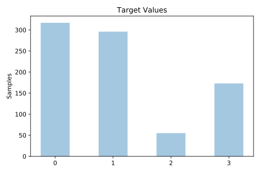
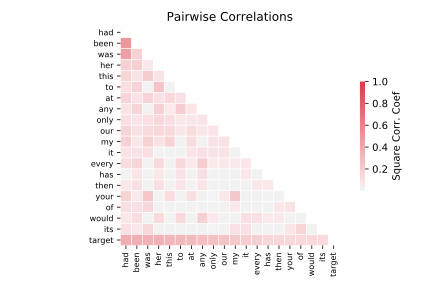

# analcatdata_authorship

[Metadata](metadata.yaml) | [Summary Statistics](summary_stats.csv)

## Summary

**task**: classification

**instances**: 841

**features**: 70

**number of classes**: 70

## Summary Plots

## Data Summary

|	variable	|	count	|	mean	|	std	|	min	|	25%	|	50%	|	75%	|	max|
| --- | --- | --- | --- | --- | --- | --- | --- | --- |
|	a	|	841	|	30	|	10	|	0	|	24	|	30	|	38	|	63
|	all	|	841	|	8	|	4	|	1	|	6	|	8	|	11	|	30
|	also	|	841	|	0	|	0	|	0	|	0	|	0	|	1	|	6
|	an	|	841	|	6	|	8	|	0	|	3	|	4	|	7	|	78
|	and	|	841	|	57	|	15	|	5	|	46	|	55	|	67	|	139
|	any	|	841	|	2	|	2	|	0	|	1	|	2	|	4	|	15
|	are	|	841	|	4	|	3	|	0	|	1	|	4	|	7	|	25
|	as	|	841	|	12	|	5	|	0	|	9	|	12	|	17	|	34
|	at	|	841	|	8	|	4	|	1	|	6	|	8	|	12	|	29
|	be	|	841	|	12	|	7	|	0	|	6	|	11	|	17	|	49
|	been	|	841	|	4	|	3	|	0	|	2	|	4	|	7	|	27
|	but	|	841	|	11	|	4	|	2	|	9	|	12	|	15	|	29
|	by	|	841	|	7	|	3	|	0	|	5	|	8	|	10	|	23
|	can	|	841	|	2	|	2	|	0	|	1	|	2	|	4	|	12
|	do	|	841	|	4	|	3	|	0	|	2	|	4	|	7	|	23
|	down	|	841	|	1	|	2	|	0	|	0	|	1	|	3	|	12
|	even	|	841	|	1	|	1	|	0	|	0	|	1	|	2	|	9
|	every	|	841	|	1	|	2	|	0	|	0	|	1	|	3	|	11
|	for	|	841	|	13	|	4	|	3	|	10	|	13	|	17	|	29
|	from	|	841	|	6	|	3	|	0	|	4	|	6	|	9	|	26
|	had	|	841	|	11	|	8	|	0	|	4	|	11	|	17	|	50
|	has	|	841	|	1	|	2	|	0	|	0	|	1	|	2	|	15
|	have	|	841	|	8	|	6	|	0	|	4	|	8	|	13	|	34
|	her	|	841	|	16	|	15	|	0	|	2	|	11	|	26	|	88
|	his	|	841	|	15	|	10	|	1	|	8	|	13	|	20	|	56
|	if	|	841	|	4	|	3	|	0	|	2	|	4	|	6	|	19
|	in	|	841	|	26	|	7	|	5	|	21	|	26	|	31	|	55
|	into	|	841	|	2	|	2	|	0	|	1	|	2	|	3	|	16
|	is	|	841	|	11	|	8	|	0	|	4	|	10	|	17	|	46
|	it	|	841	|	19	|	9	|	0	|	14	|	20	|	26	|	57
|	its	|	841	|	1	|	1	|	0	|	0	|	1	|	2	|	13
|	may	|	841	|	1	|	2	|	0	|	0	|	1	|	3	|	15
|	more	|	841	|	4	|	2	|	0	|	2	|	4	|	6	|	14
|	must	|	841	|	3	|	2	|	0	|	1	|	2	|	5	|	21
|	my	|	841	|	11	|	10	|	0	|	3	|	8	|	17	|	62
|	no	|	841	|	6	|	3	|	0	|	4	|	6	|	8	|	25
|	not	|	841	|	15	|	7	|	1	|	9	|	15	|	20	|	38
|	now	|	841	|	3	|	2	|	0	|	2	|	3	|	5	|	15
|	of	|	841	|	46	|	14	|	6	|	36	|	46	|	55	|	104
|	on	|	841	|	9	|	4	|	0	|	6	|	9	|	12	|	27
|	one	|	841	|	4	|	2	|	0	|	2	|	4	|	6	|	25
|	only	|	841	|	2	|	2	|	0	|	1	|	2	|	4	|	10
|	or	|	841	|	5	|	4	|	0	|	2	|	4	|	7	|	32
|	our	|	841	|	3	|	4	|	0	|	0	|	1	|	4	|	33
|	should	|	841	|	2	|	2	|	0	|	0	|	2	|	4	|	15
|	so	|	841	|	8	|	4	|	0	|	5	|	8	|	11	|	29
|	some	|	841	|	2	|	1	|	0	|	1	|	2	|	3	|	12
|	such	|	841	|	3	|	2	|	0	|	1	|	3	|	5	|	13
|	than	|	841	|	3	|	2	|	0	|	2	|	3	|	5	|	13
|	that	|	841	|	19	|	6	|	0	|	15	|	19	|	24	|	50
|	the	|	841	|	77	|	31	|	27	|	54	|	69	|	97	|	183
|	their	|	841	|	4	|	4	|	0	|	2	|	4	|	7	|	32
|	then	|	841	|	3	|	2	|	0	|	1	|	3	|	4	|	12
|	there	|	841	|	4	|	2	|	0	|	3	|	5	|	7	|	15
|	things	|	841	|	0	|	1	|	0	|	0	|	1	|	1	|	11
|	this	|	841	|	7	|	4	|	0	|	4	|	6	|	9	|	28
|	to	|	841	|	44	|	12	|	5	|	35	|	43	|	54	|	83
|	up	|	841	|	2	|	2	|	0	|	1	|	2	|	4	|	13
|	upon	|	841	|	2	|	2	|	0	|	1	|	2	|	3	|	10
|	was	|	841	|	22	|	15	|	0	|	8	|	23	|	34	|	66
|	were	|	841	|	6	|	5	|	0	|	3	|	5	|	9	|	32
|	what	|	841	|	6	|	3	|	0	|	3	|	5	|	8	|	26
|	when	|	841	|	4	|	2	|	0	|	3	|	4	|	6	|	15
|	which	|	841	|	4	|	3	|	0	|	2	|	4	|	7	|	20
|	who	|	841	|	3	|	2	|	0	|	1	|	3	|	5	|	21
|	will	|	841	|	5	|	5	|	0	|	1	|	4	|	8	|	61
|	with	|	841	|	14	|	5	|	0	|	11	|	14	|	17	|	38
|	would	|	841	|	4	|	3	|	0	|	2	|	4	|	7	|	25
|	your	|	841	|	5	|	5	|	0	|	1	|	3	|	8	|	34
|	BookID	|	841	|	4	|	2	|	1	|	2	|	5	|	6	|	12
|	target	|	841	|	1	|	1	|	0	|	0	|	1	|	2	|	3
