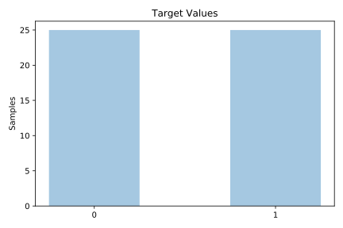
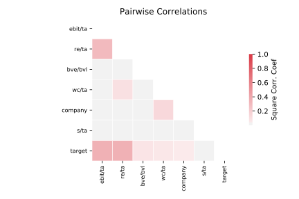

# analcatdata_bankruptcy

[Metadata](metadata.yaml) | [Summary Statistics](summary_stats.csv)

## Summary

**task**: classification

**instances**: 50

**features**: 6

**number of classes**: 6

## Summary Plots

## Data Summary

|	variable	|	count	|	mean	|	std	|	min	|	25%	|	50%	|	75%	|	max|
| --- | --- | --- | --- | --- | --- | --- | --- | --- |
|	Company	|	50	|	24	|	14	|	0	|	12	|	24	|	36	|	49
|	WC/TA	|	50	|	4	|	34	|	-127	|	-5	|	5	|	25	|	74
|	RE/TA	|	50	|	-52	|	90	|	-433	|	-75	|	-38	|	0	|	54
|	EBIT/TA	|	50	|	-7	|	26	|	-98	|	-12	|	-2	|	9	|	27
|	S/TA	|	50	|	39	|	30	|	0	|	21	|	33	|	51	|	127
|	BVE/BVL	|	50	|	3	|	5	|	0	|	0	|	1	|	3	|	35
|	target	|	50	|	0	|	0	|	0	|	0	|	0	|	1	|	1
