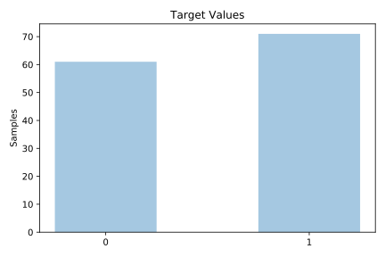
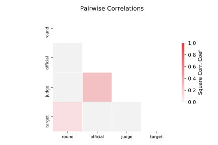

# analcatdata_boxing2

[Metadata](metadata.yaml) | [Summary Statistics](summary_stats.csv)

## Summary

**task**: classification

**instances**: 132

**features**: 3

**number of classes**: 3

## Summary Plots

## Data Summary

|	variable	|	count	|	mean	|	std	|	min	|	25%	|	50%	|	75%	|	max|
| --- | --- | --- | --- | --- | --- | --- | --- | --- |
|	Judge	|	132	|	5	|	3	|	0	|	2	|	5	|	8	|	10
|	Official	|	132	|	0	|	0	|	0	|	0	|	0	|	1	|	1
|	Round	|	132	|	6	|	3	|	1	|	3	|	6	|	9	|	12
|	target	|	132	|	0	|	0	|	0	|	0	|	1	|	1	|	1
