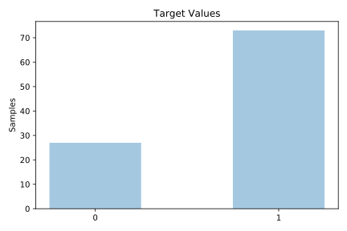
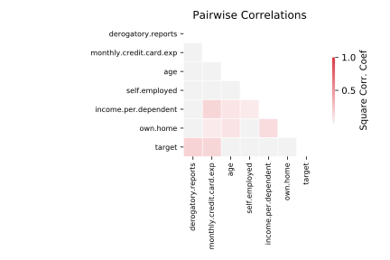

# analcatdata_creditscore

[Metadata](metadata.yaml) | [Summary Statistics](summary_stats.csv)

## Summary

**task**: classification

**instances**: 100

**features**: 6

**number of classes**: 6

## Summary Plots

## Data Summary

|	variable	|	count	|	mean	|	std	|	min	|	25%	|	50%	|	75%	|	max|
| --- | --- | --- | --- | --- | --- | --- | --- | --- |
|	Age	|	100	|	32	|	7	|	20	|	26	|	31	|	37	|	55
|	Income.per.dependent	|	100	|	3	|	1	|	1	|	2	|	3	|	3	|	10
|	Monthly.credit.card.exp	|	100	|	189	|	294	|	0	|	0	|	81	|	252	|	1898
|	Own.home	|	100	|	0	|	0	|	0	|	0	|	0	|	1	|	1
|	Self.employed	|	100	|	0	|	0	|	0	|	0	|	0	|	0	|	1
|	Derogatory.reports	|	100	|	0	|	1	|	0	|	0	|	0	|	0	|	7
|	target	|	100	|	0	|	0	|	0	|	0	|	1	|	1	|	1
