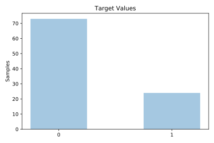
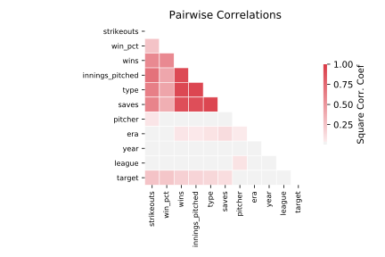

# analcatdata_cyyoung8092

[Metadata](metadata.yaml) | [Summary Statistics](summary_stats.csv)

## Summary

**task**: classification

**instances**: 97

**features**: 10

**number of classes**: 10

## Summary Plots

## Data Summary

|	variable	|	count	|	mean	|	std	|	min	|	25%	|	50%	|	75%	|	max|
| --- | --- | --- | --- | --- | --- | --- | --- | --- |
|	Year	|	97	|	1986	|	3	|	1980	|	1984	|	1987	|	1990	|	1992
|	Pitcher	|	97	|	29	|	16	|	0	|	15	|	29	|	43	|	61
|	League	|	97	|	0	|	0	|	0	|	0	|	0	|	1	|	1
|	Type	|	97	|	0	|	0	|	0	|	0	|	1	|	1	|	1
|	Wins	|	97	|	13	|	7	|	0	|	6	|	17	|	20	|	27
|	Win_pct	|	97	|	0	|	0	|	0	|	0	|	0	|	0	|	0
|	Saves	|	97	|	19	|	18	|	1	|	1	|	2	|	35	|	57
|	ERA	|	97	|	2	|	0	|	0	|	2	|	2	|	3	|	4
|	Strikeouts	|	97	|	126	|	64	|	32	|	73	|	120	|	170	|	306
|	Innings_pitched	|	97	|	175	|	83	|	58	|	89	|	208	|	258	|	304
|	target	|	97	|	0	|	0	|	0	|	0	|	0	|	0	|	1
