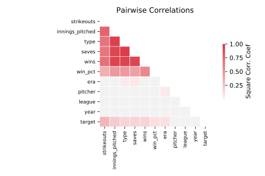

# analcatdata_cyyoung9302

[Metadata](metadata.yaml) | [Summary Statistics](summary_stats.csv)

## Summary

**task**: classification

**instances**: 92

**features**: 10

**number of classes**: 10

## Summary Plots

## Data Summary

|	variable	|	count	|	mean	|	std	|	min	|	25%	|	50%	|	75%	|	max|
| --- | --- | --- | --- | --- | --- | --- | --- | --- |
|	Year	|	92	|	1997	|	2	|	1993	|	1996	|	1998	|	2000	|	2002
|	Pitcher	|	92	|	32	|	16	|	0	|	18	|	36	|	45	|	58
|	League	|	92	|	0	|	0	|	0	|	0	|	1	|	1	|	1
|	Type	|	92	|	0	|	0	|	0	|	0	|	1	|	1	|	1
|	Wins	|	92	|	12	|	8	|	0	|	4	|	18	|	20	|	24
|	Win_pct	|	92	|	0	|	0	|	0	|	0	|	0	|	0	|	1
|	Saves	|	92	|	19	|	22	|	0	|	0	|	0	|	43	|	55
|	ERA	|	92	|	2	|	0	|	1	|	2	|	3	|	3	|	4
|	Strikeouts	|	92	|	150	|	87	|	42	|	70	|	152	|	206	|	372
|	Innings_pitched	|	92	|	160	|	81	|	49	|	72	|	205	|	232	|	271
|	target	|	92	|	0	|	0	|	0	|	0	|	0	|	0	|	1
