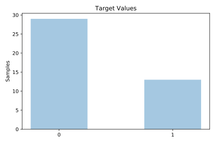
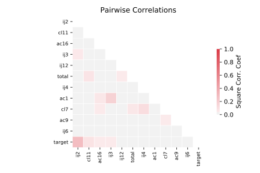

# analcatdata_fraud

[Metadata](metadata.yaml) | [Summary Statistics](summary_stats.csv)

## Summary

**task**: classification

**instances**: 42

**features**: 11

**number of classes**: 11

## Summary Plots

## Data Summary

|	variable	|	count	|	mean	|	std	|	min	|	25%	|	50%	|	75%	|	max|
| --- | --- | --- | --- | --- | --- | --- | --- | --- |
|	AC1	|	42	|	0	|	0	|	0	|	0	|	0	|	1	|	1
|	AC9	|	42	|	0	|	0	|	0	|	0	|	0	|	0	|	1
|	AC16	|	42	|	0	|	0	|	0	|	0	|	0	|	0	|	1
|	CL7	|	42	|	0	|	0	|	0	|	0	|	0	|	1	|	1
|	CL11	|	42	|	0	|	0	|	0	|	0	|	0	|	1	|	1
|	IJ2	|	42	|	0	|	0	|	0	|	0	|	1	|	1	|	1
|	IJ3	|	42	|	0	|	0	|	0	|	0	|	0	|	0	|	1
|	IJ4	|	42	|	0	|	0	|	0	|	0	|	0	|	0	|	1
|	IJ6	|	42	|	0	|	0	|	0	|	0	|	0	|	1	|	1
|	IJ12	|	42	|	0	|	0	|	0	|	0	|	0	|	0	|	1
|	Total	|	42	|	3	|	3	|	1	|	1	|	1	|	3	|	22
|	target	|	42	|	0	|	0	|	0	|	0	|	0	|	1	|	1
