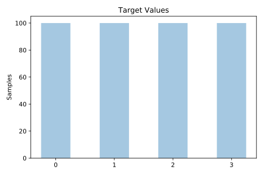
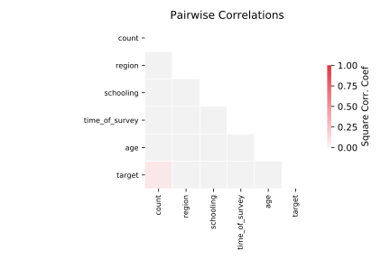

# analcatdata_germangss

[Metadata](metadata.yaml) | [Summary Statistics](summary_stats.csv)

## Summary

**task**: classification

**instances**: 400

**features**: 5

**number of classes**: 5

## Summary Plots

## Data Summary

|	variable	|	count	|	mean	|	std	|	min	|	25%	|	50%	|	75%	|	max|
| --- | --- | --- | --- | --- | --- | --- | --- | --- |
|	Age	|	400	|	2	|	1	|	0	|	1	|	2	|	3	|	4
|	Time_of_survey	|	400	|	1991	|	0	|	1991	|	1991	|	1991	|	1992	|	1992
|	Schooling	|	400	|	2	|	1	|	0	|	1	|	2	|	3	|	4
|	Region	|	400	|	0	|	0	|	0	|	0	|	0	|	1	|	1
|	Count	|	400	|	15	|	30	|	0	|	1	|	3	|	13	|	198
|	target	|	400	|	1	|	1	|	0	|	0	|	1	|	2	|	3
