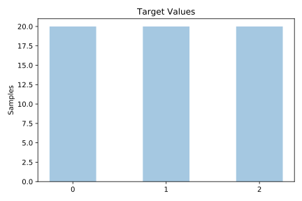
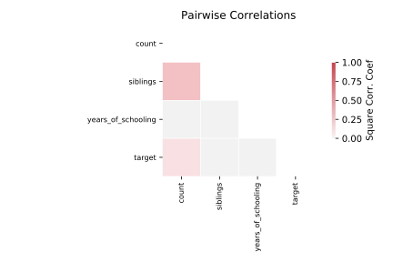

# analcatdata_happiness

[Metadata](metadata.yaml) | [Summary Statistics](summary_stats.csv)

## Summary

**task**: classification

**instances**: 60

**features**: 3

**number of classes**: 3

## Summary Plots

## Data Summary

|	variable	|	count	|	mean	|	std	|	min	|	25%	|	50%	|	75%	|	max|
| --- | --- | --- | --- | --- | --- | --- | --- | --- |
|	Years_of_schooling	|	60	|	1	|	1	|	0	|	0	|	1	|	2	|	3
|	Siblings	|	60	|	2	|	1	|	0	|	1	|	2	|	3	|	4
|	Count	|	60	|	25	|	23	|	0	|	6	|	16	|	36	|	96
|	target	|	60	|	1	|	0	|	0	|	0	|	1	|	2	|	2
