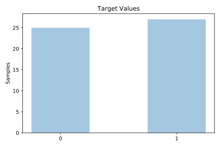
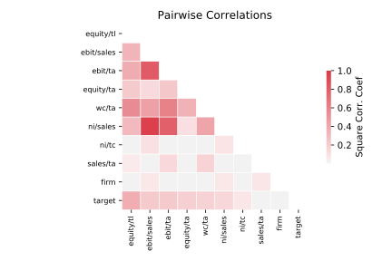

# analcatdata_japansolvent

[Metadata](metadata.yaml) | [Summary Statistics](summary_stats.csv)

## Summary

**task**: classification

**instances**: 52

**features**: 9

**number of classes**: 9

## Summary Plots

## Data Summary

|	variable	|	count	|	mean	|	std	|	min	|	25%	|	50%	|	75%	|	max|
| --- | --- | --- | --- | --- | --- | --- | --- | --- |
|	Firm	|	52	|	25	|	15	|	0	|	12	|	25	|	38	|	51
|	EBIT/TA	|	52	|	0	|	0	|	0	|	0	|	0	|	0	|	0
|	NI/TC	|	52	|	0	|	0	|	-4	|	0	|	0	|	0	|	0
|	Sales/TA	|	52	|	1	|	0	|	0	|	0	|	1	|	1	|	4
|	EBIT/Sales	|	52	|	0	|	0	|	0	|	0	|	0	|	0	|	0
|	NI/Sales	|	52	|	0	|	0	|	0	|	0	|	0	|	0	|	0
|	WC/TA	|	52	|	0	|	0	|	-1	|	0	|	0	|	0	|	0
|	Equity/TL	|	52	|	0	|	0	|	0	|	0	|	0	|	0	|	1
|	Equity/TA	|	52	|	0	|	0	|	-3	|	0	|	0	|	0	|	0
|	target	|	52	|	0	|	0	|	0	|	0	|	1	|	1	|	1
