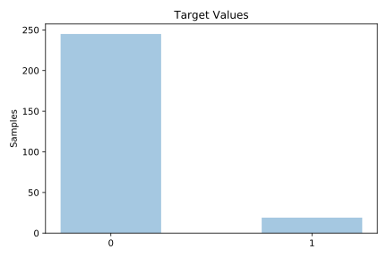
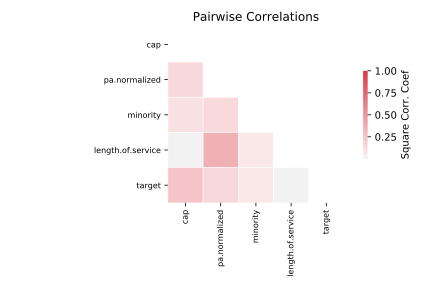

# analcatdata_lawsuit

[Metadata](metadata.yaml) | [Summary Statistics](summary_stats.csv)

## Summary

**task**: classification

**instances**: 264

**features**: 4

**number of classes**: 4

## Summary Plots

## Data Summary

|	variable	|	count	|	mean	|	std	|	min	|	25%	|	50%	|	75%	|	max|
| --- | --- | --- | --- | --- | --- | --- | --- | --- |
|	Length.of.service	|	264	|	12	|	7	|	0	|	7	|	10	|	17	|	42
|	CAP	|	264	|	35	|	13	|	6	|	27	|	36	|	45	|	60
|	PA.normalized	|	264	|	20	|	6	|	1	|	17	|	20	|	24	|	30
|	Minority	|	264	|	0	|	0	|	0	|	0	|	0	|	1	|	1
|	target	|	264	|	0	|	0	|	0	|	0	|	0	|	0	|	1
