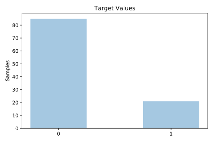
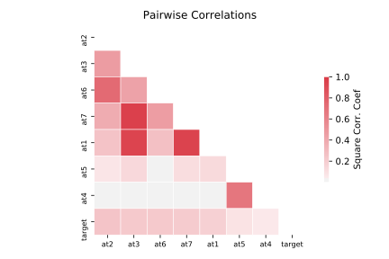

# appendicitis

[Metadata](metadata.yaml) | [Summary Statistics](summary_stats.csv)

## Summary

**task**: classification

**instances**: 106

**features**: 7

**number of classes**: 7

## Summary Plots

## Data Summary

|	variable	|	count	|	mean	|	std	|	min	|	25%	|	50%	|	75%	|	max|
| --- | --- | --- | --- | --- | --- | --- | --- | --- |
|	At1	|	106	|	0	|	0	|	0	|	0	|	0	|	0	|	1
|	At2	|	106	|	0	|	0	|	0	|	0	|	0	|	0	|	1
|	At3	|	106	|	0	|	0	|	0	|	0	|	0	|	0	|	1
|	At4	|	106	|	0	|	0	|	0	|	0	|	0	|	0	|	1
|	At5	|	106	|	0	|	0	|	0	|	0	|	0	|	0	|	1
|	At6	|	106	|	0	|	0	|	0	|	0	|	0	|	0	|	1
|	At7	|	106	|	0	|	0	|	0	|	0	|	0	|	0	|	1
|	target	|	106	|	0	|	0	|	0	|	0	|	0	|	0	|	1
