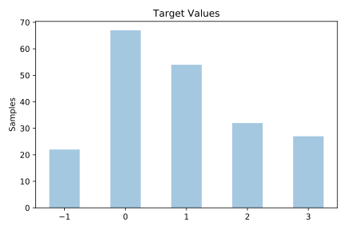
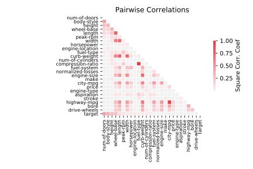

# auto

[Metadata](metadata.yaml) | [Summary Statistics](summary_stats.csv)

## Summary

**task**: classification

**instances**: 202

**features**: 25

**number of classes**: 25

## Summary Plots

## Data Summary

|	variable	|	count	|	mean	|	std	|	min	|	25%	|	50%	|	75%	|	max|
| --- | --- | --- | --- | --- | --- | --- | --- | --- |
|	normalized-losses	|	202	|	30	|	16	|	0	|	16	|	29	|	48	|	51
|	make	|	202	|	12	|	6	|	0	|	8	|	12	|	19	|	21
|	fuel-type	|	202	|	0	|	0	|	0	|	1	|	1	|	1	|	1
|	aspiration	|	202	|	0	|	0	|	0	|	0	|	0	|	0	|	1
|	num-of-doors	|	202	|	1	|	0	|	0	|	1	|	1	|	2	|	2
|	body-style	|	202	|	2	|	0	|	0	|	2	|	3	|	3	|	4
|	drive-wheels	|	202	|	1	|	0	|	0	|	1	|	1	|	2	|	2
|	engine-location	|	202	|	0	|	0	|	0	|	0	|	0	|	0	|	1
|	wheel-base	|	202	|	98	|	6	|	86	|	94	|	96	|	101	|	120
|	length	|	202	|	173	|	12	|	141	|	166	|	173	|	181	|	208
|	width	|	202	|	65	|	2	|	60	|	64	|	65	|	66	|	72
|	height	|	202	|	53	|	2	|	47	|	52	|	54	|	55	|	59
|	curb-weight	|	202	|	2549	|	522	|	1488	|	2145	|	2412	|	2924	|	4066
|	engine-type	|	202	|	3	|	1	|	0	|	3	|	3	|	3	|	6
|	num-of-cylinders	|	202	|	2	|	0	|	0	|	2	|	2	|	2	|	6
|	engine-size	|	202	|	126	|	41	|	61	|	97	|	115	|	144	|	326
|	fuel-system	|	202	|	3	|	2	|	0	|	1	|	4	|	5	|	7
|	bore	|	202	|	18	|	10	|	0	|	11	|	16	|	27	|	38
|	stroke	|	202	|	19	|	8	|	0	|	13	|	21	|	25	|	36
|	compression-ratio	|	202	|	10	|	3	|	7	|	8	|	9	|	9	|	23
|	horsepower	|	202	|	32	|	18	|	0	|	13	|	40	|	47	|	59
|	peak-rpm	|	202	|	11	|	5	|	0	|	8	|	12	|	16	|	23
|	city-mpg	|	202	|	25	|	6	|	13	|	19	|	24	|	30	|	49
|	highway-mpg	|	202	|	30	|	6	|	16	|	25	|	30	|	35	|	54
|	price	|	202	|	97	|	54	|	0	|	50	|	100	|	144	|	186
|	target	|	202	|	0	|	1	|	-1	|	0	|	1	|	2	|	3
