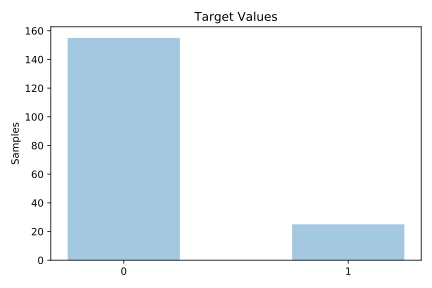
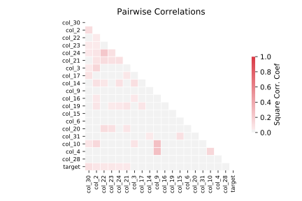

# backache

[Metadata](metadata.yaml) | [Summary Statistics](summary_stats.csv)

## Summary

**task**: classification

**instances**: 180

**features**: 32

**number of classes**: 32

## Summary Plots

## Data Summary

|	variable	|	count	|	mean	|	std	|	min	|	25%	|	50%	|	75%	|	max|
| --- | --- | --- | --- | --- | --- | --- | --- | --- |
|	id	|	180	|	90	|	52	|	1	|	45	|	90	|	135	|	180
|	col_2	|	180	|	1	|	0	|	0	|	1	|	1	|	2	|	3
|	col_3	|	180	|	3	|	3	|	0	|	0	|	4	|	7	|	9
|	col_4	|	180	|	26	|	5	|	15	|	22	|	25	|	29	|	42
|	col_5	|	180	|	1	|	0	|	1	|	1	|	1	|	1	|	1
|	col_6	|	180	|	59	|	10	|	38	|	52	|	58	|	65	|	95
|	col_7	|	180	|	70	|	11	|	47	|	63	|	70	|	77	|	100
|	col_8	|	180	|	3	|	0	|	1	|	2	|	3	|	3	|	6
|	col_9	|	180	|	0	|	1	|	0	|	0	|	0	|	1	|	7
|	col_10	|	180	|	1	|	1	|	0	|	1	|	1	|	2	|	4
|	col_11	|	180	|	0	|	0	|	0	|	0	|	0	|	0	|	1
|	col_12	|	180	|	0	|	0	|	0	|	0	|	0	|	0	|	1
|	col_13	|	180	|	0	|	0	|	0	|	0	|	0	|	0	|	1
|	col_14	|	180	|	0	|	0	|	0	|	0	|	0	|	1	|	1
|	col_15	|	180	|	0	|	0	|	0	|	0	|	0	|	0	|	1
|	col_16	|	180	|	0	|	0	|	0	|	0	|	0	|	0	|	1
|	col_17	|	180	|	0	|	0	|	0	|	0	|	0	|	0	|	1
|	col_18	|	180	|	0	|	0	|	0	|	0	|	0	|	0	|	1
|	col_19	|	180	|	0	|	0	|	0	|	0	|	0	|	0	|	1
|	col_20	|	180	|	0	|	0	|	0	|	0	|	0	|	0	|	1
|	col_21	|	180	|	0	|	0	|	0	|	0	|	0	|	0	|	1
|	col_22	|	180	|	0	|	0	|	0	|	0	|	0	|	0	|	1
|	col_23	|	180	|	0	|	0	|	0	|	0	|	0	|	0	|	1
|	col_24	|	180	|	0	|	0	|	0	|	0	|	0	|	0	|	1
|	col_25	|	180	|	0	|	0	|	0	|	0	|	0	|	0	|	1
|	col_26	|	180	|	0	|	0	|	0	|	0	|	0	|	0	|	1
|	col_27	|	180	|	0	|	0	|	0	|	0	|	0	|	0	|	1
|	col_28	|	180	|	0	|	0	|	0	|	0	|	0	|	0	|	1
|	col_29	|	180	|	0	|	0	|	0	|	0	|	0	|	0	|	1
|	col_30	|	180	|	0	|	0	|	0	|	0	|	0	|	1	|	1
|	col_31	|	180	|	0	|	0	|	0	|	0	|	0	|	0	|	1
|	col_32	|	180	|	0	|	0	|	0	|	0	|	0	|	0	|	1
|	target	|	180	|	0	|	0	|	0	|	0	|	0	|	0	|	1
