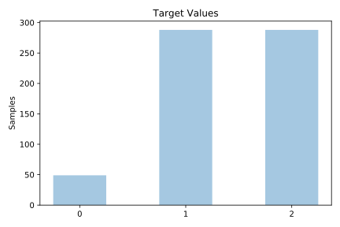
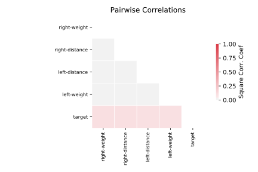

# balance_scale

[Metadata](metadata.yaml) | [Summary Statistics](summary_stats.csv)

## Summary

**task**: classification

**instances**: 625

**features**: 4

**number of classes**: 4

## Summary Plots

## Data Summary

|	variable	|	count	|	mean	|	std	|	min	|	25%	|	50%	|	75%	|	max|
| --- | --- | --- | --- | --- | --- | --- | --- | --- |
|	Left-Weight	|	625	|	3	|	1	|	1	|	2	|	3	|	4	|	5
|	Left-Distance	|	625	|	3	|	1	|	1	|	2	|	3	|	4	|	5
|	Right-Weight	|	625	|	3	|	1	|	1	|	2	|	3	|	4	|	5
|	Right-Distance	|	625	|	3	|	1	|	1	|	2	|	3	|	4	|	5
|	target	|	625	|	1	|	0	|	0	|	1	|	1	|	2	|	2
