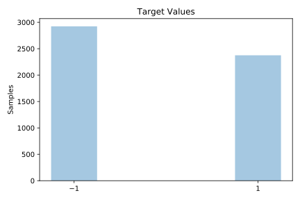
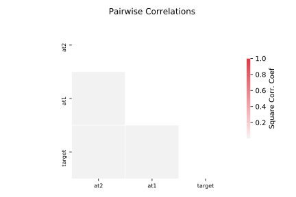

# banana

[Metadata](metadata.yaml) | [Summary Statistics](summary_stats.csv)

## Summary

**task**: classification

**instances**: 5300

**features**: 2

**number of classes**: 2

## Summary Plots

## Data Summary

|	variable	|	count	|	mean	|	std	|	min	|	25%	|	50%	|	75%	|	max|
| --- | --- | --- | --- | --- | --- | --- | --- | --- |
|	At1	|	5300	|	0	|	0	|	-3	|	0	|	0	|	0	|	2
|	At2	|	5300	|	0	|	1	|	-2	|	0	|	0	|	0	|	3
|	target	|	5300	|	0	|	0	|	-1	|	-1	|	-1	|	1	|	1
