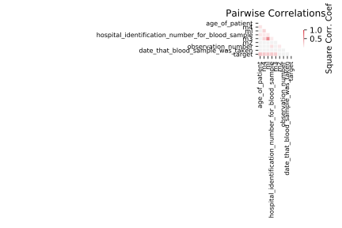

# biomed

[Metadata](metadata.yaml) | [Summary Statistics](summary_stats.csv)

## Summary

**task**: classification

**instances**: 209

**features**: 8

**number of classes**: 8

## Summary Plots

## Data Summary

|	variable	|	count	|	mean	|	std	|	min	|	25%	|	50%	|	75%	|	max|
| --- | --- | --- | --- | --- | --- | --- | --- | --- |
|	Observation_number	|	209	|	1	|	0	|	1	|	1	|	1	|	2	|	7
|	Hospital_identification_number_for_blood_sample	|	209	|	1054	|	218	|	657	|	907	|	1009	|	1255	|	1538
|	Age_of_patient	|	209	|	32	|	8	|	20	|	26	|	31	|	36	|	61
|	Date_that_blood_sample_was_taken	|	209	|	65772	|	29164	|	10078	|	40079	|	70078	|	90078	|	120079
|	ml	|	209	|	92	|	152	|	15	|	30	|	41	|	73	|	1288
|	m2	|	209	|	65	|	34	|	0	|	39	|	70	|	93	|	119
|	m3	|	209	|	16	|	13	|	2	|	10	|	13	|	18	|	111
|	m4	|	209	|	56	|	34	|	0	|	29	|	50	|	83	|	125
|	target	|	209	|	0	|	0	|	0	|	0	|	1	|	1	|	1
