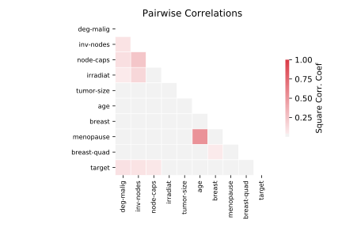

# breast_cancer

[Metadata](metadata.yaml) | [Summary Statistics](summary_stats.csv)

## Summary

**task**: classification

**instances**: 286

**features**: 9

**number of classes**: 9

## Summary Plots

## Data Summary

|	variable	|	count	|	mean	|	std	|	min	|	25%	|	50%	|	75%	|	max|
| --- | --- | --- | --- | --- | --- | --- | --- | --- |
|	age	|	286	|	2	|	1	|	0	|	2	|	3	|	3	|	5
|	menopause	|	286	|	1	|	0	|	0	|	0	|	2	|	2	|	2
|	tumor-size	|	286	|	4	|	2	|	0	|	3	|	4	|	5	|	10
|	inv-nodes	|	286	|	1	|	1	|	0	|	0	|	0	|	1	|	6
|	node-caps	|	286	|	1	|	0	|	0	|	1	|	1	|	1	|	2
|	deg-malig	|	286	|	2	|	0	|	1	|	2	|	2	|	3	|	3
|	breast	|	286	|	0	|	0	|	0	|	0	|	0	|	1	|	1
|	breast-quad	|	286	|	2	|	1	|	0	|	2	|	3	|	3	|	5
|	irradiat	|	286	|	0	|	0	|	0	|	0	|	0	|	0	|	1
|	target	|	286	|	0	|	0	|	0	|	0	|	0	|	1	|	1
