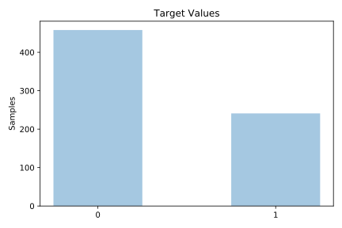
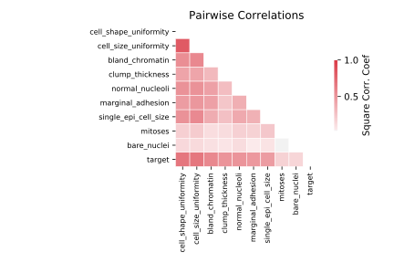

# breast_w

[Metadata](metadata.yaml) | [Summary Statistics](summary_stats.csv)

## Summary

**task**: classification

**instances**: 699

**features**: 9

**number of classes**: 9

## Summary Plots

## Data Summary

|	variable	|	count	|	mean	|	std	|	min	|	25%	|	50%	|	75%	|	max|
| --- | --- | --- | --- | --- | --- | --- | --- | --- |
|	Clump_Thickness	|	699	|	4	|	2	|	1	|	2	|	4	|	6	|	10
|	Cell_Size_Uniformity	|	699	|	3	|	3	|	1	|	1	|	1	|	5	|	10
|	Cell_Shape_Uniformity	|	699	|	3	|	2	|	1	|	1	|	1	|	5	|	10
|	Marginal_Adhesion	|	699	|	2	|	2	|	1	|	1	|	1	|	4	|	10
|	Single_Epi_Cell_Size	|	699	|	3	|	2	|	1	|	2	|	2	|	4	|	10
|	Bare_Nuclei	|	699	|	1	|	2	|	0	|	0	|	0	|	1	|	10
|	Bland_Chromatin	|	699	|	3	|	2	|	1	|	2	|	3	|	5	|	10
|	Normal_Nucleoli	|	699	|	2	|	3	|	1	|	1	|	1	|	4	|	10
|	Mitoses	|	699	|	1	|	1	|	1	|	1	|	1	|	1	|	10
|	target	|	699	|	0	|	0	|	0	|	0	|	0	|	1	|	1
