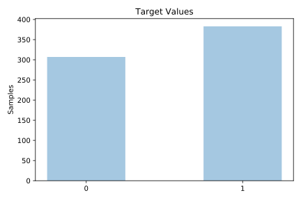
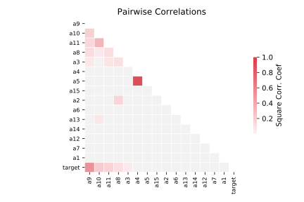

# buggyCrx

[Metadata](metadata.yaml) | [Summary Statistics](summary_stats.csv)

## Summary

**task**: classification

**instances**: 690

**features**: 15

**number of classes**: 15

## Summary Plots

## Data Summary

|	variable	|	count	|	mean	|	std	|	min	|	25%	|	50%	|	75%	|	max|
| --- | --- | --- | --- | --- | --- | --- | --- | --- |
|	A1	|	690	|	1	|	0	|	0	|	1	|	2	|	2	|	2
|	A2	|	690	|	150	|	96	|	0	|	71	|	133	|	226	|	349
|	A3	|	690	|	4	|	4	|	0	|	1	|	2	|	7	|	28
|	A4	|	690	|	2	|	0	|	0	|	2	|	2	|	2	|	3
|	A5	|	690	|	1	|	0	|	0	|	1	|	1	|	1	|	3
|	A6	|	690	|	6	|	4	|	0	|	2	|	6	|	11	|	14
|	A7	|	690	|	5	|	2	|	0	|	4	|	8	|	8	|	9
|	A8	|	690	|	2	|	3	|	0	|	0	|	1	|	2	|	28
|	A9	|	690	|	0	|	0	|	0	|	0	|	1	|	1	|	1
|	A10	|	690	|	0	|	0	|	0	|	0	|	0	|	1	|	1
|	A11	|	690	|	2	|	4	|	0	|	0	|	0	|	3	|	67
|	A12	|	690	|	0	|	0	|	0	|	0	|	0	|	1	|	1
|	A13	|	690	|	0	|	0	|	0	|	0	|	0	|	0	|	2
|	A14	|	690	|	56	|	54	|	0	|	7	|	40	|	95	|	170
|	A15	|	690	|	1017	|	5210	|	0	|	0	|	5	|	395	|	100000
|	target	|	690	|	0	|	0	|	0	|	0	|	1	|	1	|	1
