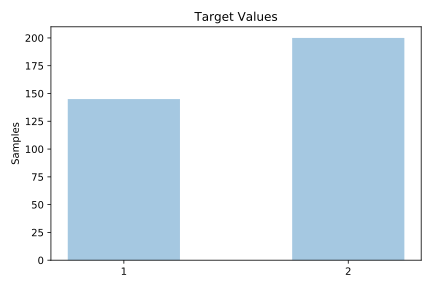
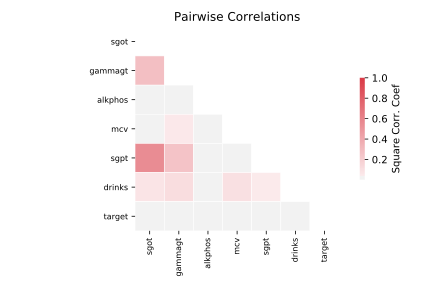

# bupa

[Metadata](metadata.yaml) | [Summary Statistics](summary_stats.csv)

## Summary

- **task**: classification
- **number of instances**: 345
- **number of features**: 5
- **number of classes**: 2.0

## Summary Plots

## Data Summary

|         |   count |      mean |       std |   min |   25% |   50% |   75% |   max |
|:--------|--------:|----------:|----------:|------:|------:|------:|------:|------:|
| Mcv     |     345 | 90.1594   |  4.4481   |    65 |    87 |    90 |    93 |   103 |
| Alkphos |     345 | 69.8696   | 18.3477   |    23 |    57 |    67 |    80 |   138 |
| Sgpt    |     345 | 30.4058   | 19.5123   |     4 |    19 |    26 |    34 |   155 |
| Sgot    |     345 | 24.6435   | 10.0645   |     5 |    19 |    23 |    27 |    82 |
| Gammagt |     345 | 38.2841   | 39.2546   |     5 |    15 |    25 |    46 |   297 |
| target  |     345 |  0.449275 |  0.498143 |     0 |     0 |     0 |     1 |     1 |
