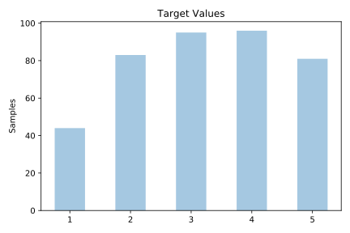
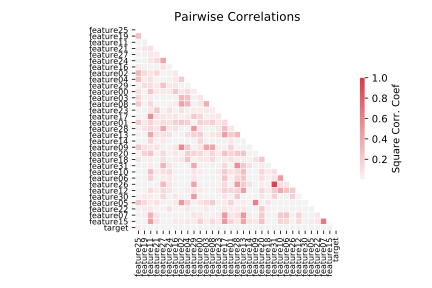

# calendarDOW

[Metadata](metadata.yaml) | [Summary Statistics](summary_stats.csv)

## Summary

**task**: classification

**instances**: 399

**features**: 32

**number of classes**: 32

## Summary Plots

## Data Summary

|	variable	|	count	|	mean	|	std	|	min	|	25%	|	50%	|	75%	|	max|
| --- | --- | --- | --- | --- | --- | --- | --- | --- |
|	Feature00	|	399	|	18	|	6	|	0	|	14	|	23	|	23	|	23
|	Feature01	|	399	|	22	|	11	|	0	|	11	|	31	|	31	|	31
|	Feature02	|	399	|	6	|	2	|	0	|	5	|	6	|	9	|	9
|	Feature03	|	399	|	5	|	1	|	0	|	5	|	7	|	7	|	7
|	Feature04	|	399	|	9	|	2	|	0	|	8	|	10	|	12	|	12
|	Feature05	|	399	|	5	|	1	|	0	|	4	|	6	|	7	|	7
|	Feature06	|	399	|	13	|	3	|	0	|	12	|	15	|	15	|	15
|	Feature07	|	399	|	13	|	3	|	0	|	12	|	15	|	17	|	17
|	Feature08	|	399	|	6	|	2	|	0	|	4	|	8	|	8	|	8
|	Feature09	|	399	|	3	|	1	|	0	|	3	|	4	|	5	|	5
|	Feature10	|	399	|	4	|	1	|	0	|	3	|	5	|	5	|	5
|	Feature11	|	399	|	3	|	1	|	0	|	2	|	4	|	5	|	5
|	Feature12	|	399	|	34	|	15	|	0	|	28	|	45	|	45	|	45
|	Feature13	|	399	|	47	|	24	|	0	|	23	|	57	|	69	|	69
|	Feature14	|	399	|	4	|	0	|	0	|	4	|	5	|	5	|	6
|	Feature15	|	399	|	4	|	1	|	0	|	4	|	5	|	6	|	6
|	Feature16	|	399	|	4	|	1	|	0	|	4	|	5	|	5	|	6
|	Feature17	|	399	|	4	|	1	|	0	|	3	|	5	|	6	|	6
|	Feature18	|	399	|	42	|	10	|	0	|	43	|	47	|	47	|	50
|	Feature19	|	399	|	70	|	22	|	0	|	60	|	80	|	88	|	89
|	Feature20	|	399	|	2	|	0	|	0	|	2	|	3	|	3	|	3
|	Feature21	|	399	|	12	|	1	|	0	|	13	|	13	|	13	|	13
|	Feature22	|	399	|	1	|	0	|	0	|	2	|	2	|	2	|	2
|	Feature23	|	399	|	18	|	3	|	0	|	18	|	20	|	20	|	20
|	Feature24	|	399	|	0	|	0	|	0	|	0	|	0	|	1	|	1
|	Feature25	|	399	|	0	|	0	|	0	|	0	|	1	|	1	|	1
|	Feature26	|	399	|	0	|	0	|	0	|	0	|	1	|	1	|	2
|	Feature27	|	399	|	0	|	0	|	0	|	0	|	0	|	1	|	2
|	Feature28	|	399	|	6	|	2	|	0	|	4	|	8	|	8	|	8
|	Feature29	|	399	|	7	|	1	|	0	|	6	|	8	|	8	|	8
|	Feature30	|	399	|	12	|	2	|	0	|	13	|	14	|	14	|	14
|	Feature31	|	399	|	0	|	0	|	0	|	0	|	0	|	1	|	2
|	target	|	399	|	3	|	1	|	1	|	2	|	3	|	4	|	5
