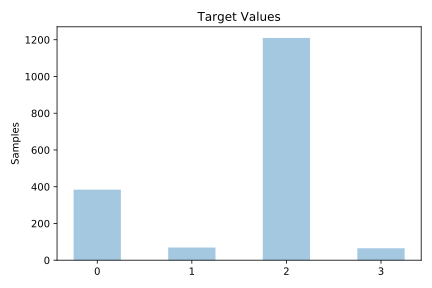
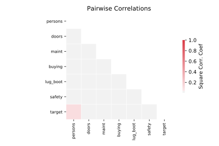

# car

[Metadata](metadata.yaml) | [Summary Statistics](summary_stats.csv)

## Summary

**task**: classification

**instances**: 1728

**features**: 6

**number of classes**: 6

## Summary Plots

## Data Summary

|	variable	|	count	|	mean	|	std	|	min	|	25%	|	50%	|	75%	|	max|
| --- | --- | --- | --- | --- | --- | --- | --- | --- |
|	buying	|	1728	|	1	|	1	|	0	|	0	|	1	|	2	|	3
|	maint	|	1728	|	1	|	1	|	0	|	0	|	1	|	2	|	3
|	doors	|	1728	|	1	|	1	|	0	|	0	|	1	|	2	|	3
|	persons	|	1728	|	1	|	0	|	0	|	0	|	1	|	2	|	2
|	lug_boot	|	1728	|	1	|	0	|	0	|	0	|	1	|	2	|	2
|	safety	|	1728	|	1	|	0	|	0	|	0	|	1	|	2	|	2
|	target	|	1728	|	1	|	0	|	0	|	1	|	2	|	2	|	3
