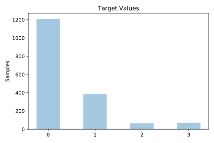
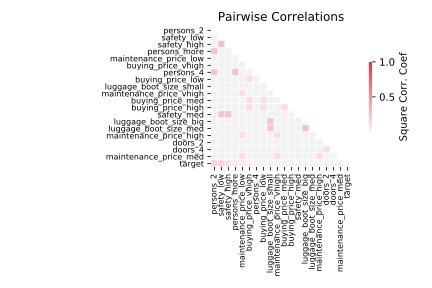

# car_evaluation

[Metadata](metadata.yaml) | [Summary Statistics](summary_stats.csv)

## Summary

**task**: classification

**instances**: 1728

**features**: 21

**number of classes**: 21

## Summary Plots

## Data Summary

|	variable	|	count	|	mean	|	std	|	min	|	25%	|	50%	|	75%	|	max|
| --- | --- | --- | --- | --- | --- | --- | --- | --- |
|	target	|	1728	|	0	|	0	|	0	|	0	|	0	|	1	|	3
|	buying_price_vhigh	|	1728	|	0	|	0	|	0	|	0	|	0	|	0	|	1
|	buying_price_high	|	1728	|	0	|	0	|	0	|	0	|	0	|	0	|	1
|	buying_price_med	|	1728	|	0	|	0	|	0	|	0	|	0	|	0	|	1
|	buying_price_low	|	1728	|	0	|	0	|	0	|	0	|	0	|	0	|	1
|	maintenance_price_vhigh	|	1728	|	0	|	0	|	0	|	0	|	0	|	0	|	1
|	maintenance_price_high	|	1728	|	0	|	0	|	0	|	0	|	0	|	0	|	1
|	maintenance_price_med	|	1728	|	0	|	0	|	0	|	0	|	0	|	0	|	1
|	maintenance_price_low	|	1728	|	0	|	0	|	0	|	0	|	0	|	0	|	1
|	doors_2	|	1728	|	0	|	0	|	0	|	0	|	0	|	0	|	1
|	doors_3	|	1728	|	0	|	0	|	0	|	0	|	0	|	0	|	1
|	doors_4	|	1728	|	0	|	0	|	0	|	0	|	0	|	0	|	1
|	doors_5more	|	1728	|	0	|	0	|	0	|	0	|	0	|	0	|	1
|	persons_2	|	1728	|	0	|	0	|	0	|	0	|	0	|	1	|	1
|	persons_4	|	1728	|	0	|	0	|	0	|	0	|	0	|	1	|	1
|	persons_more	|	1728	|	0	|	0	|	0	|	0	|	0	|	1	|	1
|	luggage_boot_size_small	|	1728	|	0	|	0	|	0	|	0	|	0	|	1	|	1
|	luggage_boot_size_med	|	1728	|	0	|	0	|	0	|	0	|	0	|	1	|	1
|	luggage_boot_size_big	|	1728	|	0	|	0	|	0	|	0	|	0	|	1	|	1
|	safety_low	|	1728	|	0	|	0	|	0	|	0	|	0	|	1	|	1
|	safety_med	|	1728	|	0	|	0	|	0	|	0	|	0	|	1	|	1
|	safety_high	|	1728	|	0	|	0	|	0	|	0	|	0	|	1	|	1
