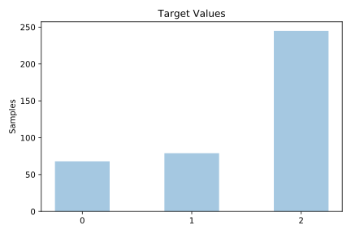
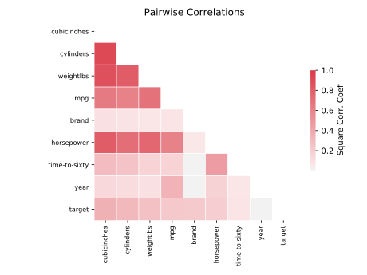

# cars

[Metadata](metadata.yaml) | [Summary Statistics](summary_stats.csv)

## Summary

- **task**: classification
- **number of instances**: 392
- **number of features**: 8
- **number of classes**: 3.0

## Summary Plots

## Data Summary

|               |   count |       mean |        std |   min |     25% |     50% |     75% |    max |
|:--------------|--------:|-----------:|-----------:|------:|--------:|--------:|--------:|-------:|
| MPG           |     392 |   23.4459  |   7.80501  |     9 |   17    |   22.75 |   29    |   46.6 |
| cylinders     |     392 |    5.47194 |   1.70578  |     3 |    4    |    4    |    8    |    8   |
| cubicInches   |     392 |  194.413   | 104.643    |    68 |  105    |  151    |  275.75 |  455   |
| horsepower    |     392 |  104.469   |  38.4912   |    46 |   75    |   93.5  |  126    |  230   |
| weightLbs     |     392 | 2977.58    | 849.403    |  1613 | 2225.25 | 2803.5  | 3614.75 | 5140   |
| time-to-sixty |     392 |   15.6811  |   2.76123  |     8 |   14    |   16    |   17    |   25   |
| year          |     392 | 1976.98    |   3.68374  |  1971 | 1974    | 1977    | 1980    | 1983   |
| brand         |     392 |   13.324   |   8.55879  |     0 |    6    |   11    |   21    |   29   |
| target        |     392 |    1.45153 |   0.772082 |     0 |    1    |    2    |    2    |    2   |
