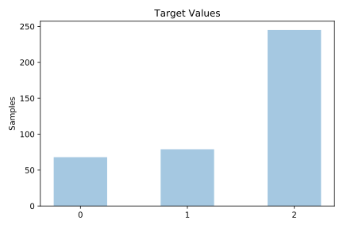
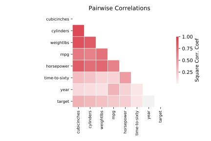

# cars1

[Metadata](metadata.yaml) | [Summary Statistics](summary_stats.csv)

## Summary

**task**: classification

**instances**: 392

**features**: 7

**number of classes**: 7

## Summary Plots

## Data Summary

|	variable	|	count	|	mean	|	std	|	min	|	25%	|	50%	|	75%	|	max|
| --- | --- | --- | --- | --- | --- | --- | --- | --- |
|	MPG	|	392	|	23	|	7	|	9	|	17	|	22	|	29	|	46
|	cylinders	|	392	|	5	|	1	|	3	|	4	|	4	|	8	|	8
|	cubicInches	|	392	|	194	|	104	|	68	|	105	|	151	|	275	|	455
|	horsepower	|	392	|	104	|	38	|	46	|	75	|	93	|	126	|	230
|	weightLbs	|	392	|	2977	|	849	|	1613	|	2225	|	2803	|	3614	|	5140
|	time-to-sixty	|	392	|	15	|	2	|	8	|	14	|	16	|	17	|	25
|	year	|	392	|	1976	|	3	|	1971	|	1974	|	1977	|	1980	|	1983
|	target	|	392	|	1	|	0	|	0	|	1	|	2	|	2	|	2
