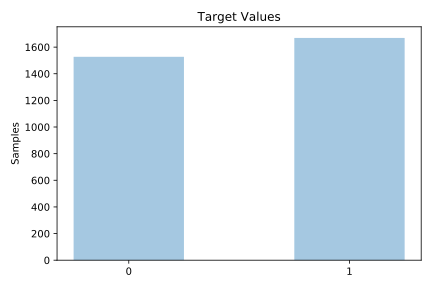
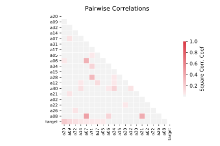

# chess

[Metadata](metadata.yaml) | [Summary Statistics](summary_stats.csv)

## Summary

**task**: classification

**instances**: 3196

**features**: 36

**number of classes**: 36

## Summary Plots

## Data Summary

|	variable	|	count	|	mean	|	std	|	min	|	25%	|	50%	|	75%	|	max|
| --- | --- | --- | --- | --- | --- | --- | --- | --- |
|	A00	|	3196	|	0	|	0	|	0	|	0	|	0	|	0	|	1
|	A01	|	3196	|	0	|	0	|	0	|	0	|	0	|	0	|	1
|	A02	|	3196	|	0	|	0	|	0	|	0	|	0	|	0	|	1
|	A03	|	3196	|	0	|	0	|	0	|	0	|	0	|	0	|	1
|	A04	|	3196	|	0	|	0	|	0	|	0	|	0	|	1	|	1
|	A05	|	3196	|	0	|	0	|	0	|	0	|	0	|	1	|	1
|	A06	|	3196	|	0	|	0	|	0	|	0	|	0	|	1	|	1
|	A07	|	3196	|	0	|	0	|	0	|	0	|	0	|	0	|	1
|	A08	|	3196	|	0	|	0	|	0	|	0	|	0	|	1	|	1
|	A09	|	3196	|	0	|	0	|	0	|	0	|	0	|	1	|	1
|	A10	|	3196	|	0	|	0	|	0	|	0	|	0	|	1	|	1
|	A11	|	3196	|	0	|	0	|	0	|	0	|	0	|	0	|	1
|	A12	|	3196	|	0	|	0	|	0	|	0	|	1	|	1	|	1
|	A13	|	3196	|	0	|	0	|	0	|	0	|	0	|	0	|	1
|	A14	|	3196	|	1	|	0	|	0	|	1	|	1	|	1	|	2
|	A15	|	3196	|	0	|	0	|	0	|	0	|	0	|	0	|	1
|	A16	|	3196	|	0	|	0	|	0	|	0	|	0	|	0	|	1
|	A17	|	3196	|	0	|	0	|	0	|	0	|	1	|	1	|	1
|	A18	|	3196	|	0	|	0	|	0	|	0	|	0	|	0	|	1
|	A19	|	3196	|	0	|	0	|	0	|	0	|	0	|	0	|	1
|	A20	|	3196	|	0	|	0	|	0	|	0	|	0	|	0	|	1
|	A21	|	3196	|	0	|	0	|	0	|	0	|	0	|	0	|	1
|	A22	|	3196	|	0	|	0	|	0	|	0	|	0	|	0	|	1
|	A23	|	3196	|	0	|	0	|	0	|	0	|	0	|	1	|	1
|	A24	|	3196	|	0	|	0	|	0	|	0	|	0	|	0	|	1
|	A25	|	3196	|	0	|	0	|	0	|	0	|	1	|	1	|	1
|	A26	|	3196	|	0	|	0	|	0	|	0	|	0	|	0	|	1
|	A27	|	3196	|	0	|	0	|	0	|	0	|	0	|	0	|	1
|	A28	|	3196	|	0	|	0	|	0	|	0	|	0	|	0	|	1
|	A29	|	3196	|	0	|	0	|	0	|	0	|	0	|	0	|	1
|	A30	|	3196	|	0	|	0	|	0	|	0	|	0	|	0	|	1
|	A31	|	3196	|	0	|	0	|	0	|	0	|	0	|	0	|	1
|	A32	|	3196	|	0	|	0	|	0	|	0	|	0	|	1	|	1
|	A33	|	3196	|	0	|	0	|	0	|	0	|	1	|	1	|	1
|	A34	|	3196	|	0	|	0	|	0	|	0	|	1	|	1	|	1
|	A35	|	3196	|	0	|	0	|	0	|	0	|	0	|	0	|	1
|	target	|	3196	|	0	|	0	|	0	|	0	|	1	|	1	|	1
