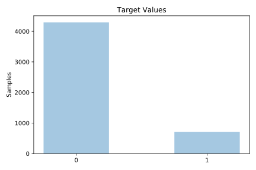
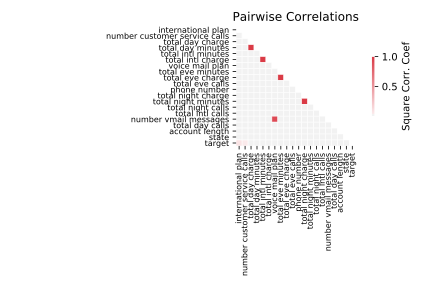

# churn

[Metadata](metadata.yaml) | [Summary Statistics](summary_stats.csv)

## Summary

**task**: classification

**instances**: 5000

**features**: 20

**number of classes**: 20

## Summary Plots

## Data Summary

|	variable	|	count	|	mean	|	std	|	min	|	25%	|	50%	|	75%	|	max|
| --- | --- | --- | --- | --- | --- | --- | --- | --- |
|	state	|	5000	|	25	|	14	|	0	|	13	|	26	|	39	|	50
|	account length	|	5000	|	100	|	39	|	1	|	73	|	100	|	127	|	243
|	area code	|	5000	|	436	|	42	|	408	|	408	|	415	|	415	|	510
|	phone number	|	5000	|	2499	|	1443	|	0	|	1249	|	2499	|	3749	|	4999
|	international plan	|	5000	|	0	|	0	|	0	|	0	|	0	|	0	|	1
|	voice mail plan	|	5000	|	0	|	0	|	0	|	0	|	0	|	1	|	1
|	number vmail messages	|	5000	|	7	|	13	|	0	|	0	|	0	|	17	|	52
|	total day minutes	|	5000	|	180	|	53	|	0	|	143	|	180	|	216	|	351
|	total day calls	|	5000	|	100	|	19	|	0	|	87	|	100	|	113	|	165
|	total day charge	|	5000	|	30	|	9	|	0	|	24	|	30	|	36	|	59
|	total eve minutes	|	5000	|	200	|	50	|	0	|	166	|	201	|	234	|	363
|	total eve calls	|	5000	|	100	|	19	|	0	|	87	|	100	|	114	|	170
|	total eve charge	|	5000	|	17	|	4	|	0	|	14	|	17	|	19	|	30
|	total night minutes	|	5000	|	200	|	50	|	0	|	166	|	200	|	234	|	395
|	total night calls	|	5000	|	99	|	19	|	0	|	87	|	100	|	113	|	175
|	total night charge	|	5000	|	9	|	2	|	0	|	7	|	9	|	10	|	17
|	total intl minutes	|	5000	|	10	|	2	|	0	|	8	|	10	|	12	|	20
|	total intl calls	|	5000	|	4	|	2	|	0	|	3	|	4	|	6	|	20
|	total intl charge	|	5000	|	2	|	0	|	0	|	2	|	2	|	3	|	5
|	number customer service calls	|	5000	|	1	|	1	|	0	|	1	|	1	|	2	|	9
|	target	|	5000	|	0	|	0	|	0	|	0	|	0	|	0	|	1
