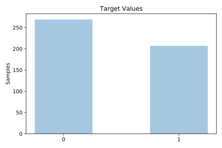
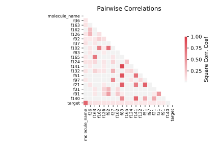

# clean1

[Metadata](metadata.yaml) | [Summary Statistics](summary_stats.csv)

## Summary

**task**: classification

**instances**: 476

**features**: 168

**number of classes**: 168

## Summary Plots

## Data Summary

|	variable	|	count	|	mean	|	std	|	min	|	25%	|	50%	|	75%	|	max|
| --- | --- | --- | --- | --- | --- | --- | --- | --- |
|	molecule_name	|	476	|	51	|	26	|	0	|	28	|	55	|	80	|	91
|	conformation_name	|	476	|	237	|	137	|	0	|	118	|	237	|	356	|	475
|	f1	|	476	|	38	|	18	|	-9	|	31	|	42	|	50	|	130
|	f2	|	476	|	-120	|	88	|	-199	|	-193	|	-144	|	-101	|	98
|	f3	|	476	|	-79	|	69	|	-166	|	-144	|	-108	|	-21	|	83
|	f4	|	476	|	15	|	75	|	-115	|	-53	|	28	|	38	|	157
|	f5	|	476	|	-112	|	28	|	-117	|	-117	|	-117	|	-117	|	238
|	f6	|	476	|	-9	|	92	|	-184	|	-89	|	11	|	70	|	200
|	f7	|	476	|	-16	|	106	|	-170	|	-159	|	41	|	51	|	214
|	f8	|	476	|	7	|	75	|	-231	|	-9	|	18	|	57	|	188
|	f9	|	476	|	-91	|	96	|	-242	|	-215	|	-41	|	-30	|	135
|	f10	|	476	|	-76	|	72	|	-284	|	-118	|	-73	|	-28	|	218
|	f11	|	476	|	-94	|	89	|	-327	|	-112	|	-57	|	-46	|	104
|	f12	|	476	|	-70	|	82	|	-326	|	-104	|	-69	|	-29	|	196
|	f13	|	476	|	-71	|	66	|	-302	|	-86	|	-62	|	-42	|	117
|	f14	|	476	|	-114	|	83	|	-348	|	-125	|	-97	|	-82	|	72
|	f15	|	476	|	-106	|	76	|	-292	|	-109	|	-94	|	-77	|	77
|	f16	|	476	|	-265	|	63	|	-318	|	-296	|	-285	|	-266	|	13
|	f17	|	476	|	-41	|	115	|	-225	|	-168	|	28	|	50	|	125
|	f18	|	476	|	-71	|	65	|	-312	|	-88	|	-69	|	-46	|	139
|	f19	|	476	|	-38	|	81	|	-291	|	-73	|	-31	|	5	|	214
|	f20	|	476	|	-48	|	69	|	-243	|	-61	|	-39	|	-18	|	273
|	f21	|	476	|	-73	|	77	|	-298	|	-106	|	-66	|	-40	|	196
|	f22	|	476	|	-63	|	87	|	-187	|	-179	|	-22	|	-14	|	147
|	f23	|	476	|	-57	|	93	|	-255	|	-143	|	-36	|	13	|	187
|	f24	|	476	|	33	|	117	|	-70	|	-61	|	-44	|	154	|	312
|	f25	|	476	|	-18	|	93	|	-102	|	-97	|	-88	|	77	|	254
|	f26	|	476	|	-73	|	89	|	-243	|	-173	|	-38	|	-6	|	162
|	f27	|	476	|	-15	|	92	|	-205	|	-114	|	27	|	53	|	157
|	f28	|	476	|	-98	|	63	|	-164	|	-150	|	-117	|	-63	|	147
|	f29	|	476	|	2	|	58	|	-140	|	-31	|	7	|	25	|	181
|	f30	|	476	|	-40	|	118	|	-154	|	-142	|	-127	|	91	|	258
|	f31	|	476	|	-100	|	46	|	-118	|	-117	|	-117	|	-115	|	190
|	f32	|	476	|	-12	|	93	|	-149	|	-101	|	-38	|	97	|	143
|	f33	|	476	|	-8	|	62	|	-124	|	-39	|	-20	|	17	|	219
|	f34	|	476	|	-127	|	111	|	-278	|	-224	|	-182	|	-5	|	163
|	f35	|	476	|	-47	|	79	|	-156	|	-129	|	-35	|	0	|	227
|	f36	|	476	|	78	|	40	|	16	|	47	|	73	|	95	|	291
|	f37	|	476	|	-109	|	114	|	-175	|	-174	|	-168	|	-153	|	224
|	f38	|	476	|	-31	|	81	|	-192	|	-110	|	-1	|	25	|	165
|	f39	|	476	|	-75	|	72	|	-145	|	-142	|	-110	|	-23	|	105
|	f40	|	476	|	-6	|	80	|	-181	|	-72	|	20	|	48	|	189
|	f41	|	476	|	-95	|	84	|	-190	|	-174	|	-124	|	-49	|	82
|	f42	|	476	|	8	|	77	|	-151	|	-43	|	17	|	75	|	201
|	f43	|	476	|	-67	|	64	|	-291	|	-80	|	-58	|	-34	|	168
|	f44	|	476	|	-101	|	88	|	-343	|	-99	|	-75	|	-64	|	81
|	f45	|	476	|	-108	|	79	|	-315	|	-125	|	-99	|	-82	|	65
|	f46	|	476	|	-148	|	88	|	-338	|	-183	|	-121	|	-101	|	115
|	f47	|	476	|	-89	|	67	|	-157	|	-147	|	-103	|	-83	|	110
|	f48	|	476	|	-93	|	71	|	-294	|	-123	|	-75	|	-55	|	99
|	f49	|	476	|	-18	|	74	|	-269	|	-44	|	-13	|	25	|	180
|	f50	|	476	|	-75	|	66	|	-273	|	-106	|	-86	|	-32	|	214
|	f51	|	476	|	-81	|	77	|	-329	|	-111	|	-87	|	-65	|	218
|	f52	|	476	|	-73	|	90	|	-205	|	-196	|	-30	|	-18	|	148
|	f53	|	476	|	-59	|	94	|	-206	|	-178	|	-20	|	-1	|	159
|	f54	|	476	|	29	|	82	|	-143	|	-8	|	51	|	72	|	286
|	f55	|	476	|	34	|	87	|	-113	|	-50	|	20	|	112	|	259
|	f56	|	476	|	-67	|	62	|	-282	|	-82	|	-58	|	-40	|	199
|	f57	|	476	|	5	|	111	|	-168	|	-125	|	56	|	91	|	231
|	f58	|	476	|	-108	|	79	|	-178	|	-155	|	-139	|	-113	|	111
|	f59	|	476	|	9	|	66	|	-173	|	-20	|	5	|	49	|	181
|	f60	|	476	|	-82	|	91	|	-254	|	-162	|	-112	|	7	|	178
|	f61	|	476	|	-8	|	99	|	-102	|	-98	|	-22	|	46	|	243
|	f62	|	476	|	-82	|	110	|	-195	|	-192	|	-130	|	51	|	173
|	f63	|	476	|	10	|	27	|	-69	|	-13	|	20	|	30	|	110
|	f64	|	476	|	-63	|	132	|	-197	|	-188	|	-131	|	95	|	220
|	f65	|	476	|	-37	|	81	|	-159	|	-121	|	-17	|	-7	|	108
|	f66	|	476	|	53	|	22	|	6	|	42	|	57	|	63	|	197
|	f67	|	476	|	-161	|	24	|	-166	|	-165	|	-165	|	-164	|	262
|	f68	|	476	|	-40	|	58	|	-196	|	-68	|	-41	|	-16	|	157
|	f69	|	476	|	-32	|	97	|	-134	|	-133	|	-33	|	64	|	205
|	f70	|	476	|	-28	|	62	|	-192	|	-61	|	-35	|	2	|	168
|	f71	|	476	|	-86	|	77	|	-174	|	-158	|	-121	|	-33	|	83
|	f72	|	476	|	-82	|	65	|	-150	|	-146	|	-121	|	-35	|	98
|	f73	|	476	|	-85	|	80	|	-322	|	-104	|	-68	|	-43	|	133
|	f74	|	476	|	-92	|	81	|	-338	|	-116	|	-83	|	-60	|	112
|	f75	|	476	|	-73	|	71	|	-272	|	-92	|	-63	|	-40	|	132
|	f76	|	476	|	-176	|	11	|	-191	|	-182	|	-180	|	-177	|	-65
|	f77	|	476	|	-81	|	113	|	-255	|	-235	|	-15	|	0	|	154
|	f78	|	476	|	-77	|	85	|	-318	|	-93	|	-56	|	-30	|	158
|	f79	|	476	|	-56	|	84	|	-310	|	-93	|	-51	|	-13	|	185
|	f80	|	476	|	16	|	82	|	-197	|	5	|	47	|	57	|	233
|	f81	|	476	|	-74	|	87	|	-258	|	-143	|	-53	|	-10	|	183
|	f82	|	476	|	-42	|	94	|	-176	|	-167	|	2	|	16	|	192
|	f83	|	476	|	-62	|	79	|	-301	|	-114	|	-58	|	-45	|	208
|	f84	|	476	|	51	|	97	|	-98	|	-37	|	63	|	137	|	251
|	f85	|	476	|	-89	|	98	|	-222	|	-174	|	-146	|	14	|	183
|	f86	|	476	|	-43	|	105	|	-200	|	-184	|	11	|	28	|	189
|	f87	|	476	|	-58	|	79	|	-208	|	-106	|	-74	|	-41	|	113
|	f88	|	476	|	-99	|	68	|	-213	|	-149	|	-112	|	-56	|	105
|	f89	|	476	|	5	|	59	|	-111	|	-46	|	16	|	30	|	163
|	f90	|	476	|	-23	|	127	|	-159	|	-146	|	-96	|	123	|	272
|	f91	|	476	|	-148	|	85	|	-202	|	-202	|	-198	|	-114	|	168
|	f92	|	476	|	44	|	46	|	-20	|	11	|	28	|	95	|	167
|	f93	|	476	|	-14	|	84	|	-121	|	-107	|	5	|	19	|	233
|	f94	|	476	|	-122	|	75	|	-326	|	-135	|	-113	|	-92	|	178
|	f95	|	476	|	8	|	32	|	-77	|	-9	|	4	|	28	|	149
|	f96	|	476	|	34	|	99	|	-70	|	-47	|	-25	|	118	|	336
|	f97	|	476	|	-46	|	97	|	-191	|	-108	|	-67	|	3	|	171
|	f98	|	476	|	-41	|	101	|	-191	|	-177	|	9	|	35	|	194
|	f99	|	476	|	-92	|	64	|	-155	|	-153	|	-141	|	-26	|	48
|	f100	|	476	|	2	|	103	|	-155	|	-124	|	40	|	80	|	235
|	f101	|	476	|	-109	|	91	|	-210	|	-194	|	-120	|	-70	|	88
|	f102	|	476	|	76	|	47	|	-37	|	33	|	73	|	129	|	265
|	f103	|	476	|	-88	|	78	|	-296	|	-103	|	-66	|	-47	|	96
|	f104	|	476	|	-98	|	85	|	-320	|	-112	|	-68	|	-57	|	95
|	f105	|	476	|	-118	|	80	|	-319	|	-117	|	-104	|	-91	|	72
|	f106	|	476	|	-95	|	80	|	-287	|	-135	|	-92	|	-44	|	179
|	f107	|	476	|	-134	|	61	|	-194	|	-174	|	-162	|	-111	|	144
|	f108	|	476	|	-110	|	75	|	-293	|	-158	|	-92	|	-56	|	52
|	f109	|	476	|	-68	|	77	|	-250	|	-77	|	-66	|	-18	|	183
|	f110	|	476	|	-112	|	74	|	-295	|	-126	|	-107	|	-91	|	53
|	f111	|	476	|	-70	|	73	|	-252	|	-69	|	-61	|	-47	|	117
|	f112	|	476	|	-54	|	88	|	-268	|	-120	|	-43	|	0	|	211
|	f113	|	476	|	-62	|	97	|	-223	|	-179	|	-33	|	16	|	188
|	f114	|	476	|	-58	|	96	|	-206	|	-181	|	-24	|	17	|	160
|	f115	|	476	|	-83	|	97	|	-251	|	-166	|	-129	|	19	|	201
|	f116	|	476	|	-36	|	64	|	-252	|	-63	|	-24	|	-2	|	187
|	f117	|	476	|	11	|	120	|	-104	|	-91	|	-81	|	154	|	315
|	f118	|	476	|	-36	|	106	|	-209	|	-151	|	7	|	53	|	137
|	f119	|	476	|	-7	|	118	|	-193	|	-153	|	66	|	81	|	215
|	f120	|	476	|	-38	|	94	|	-201	|	-150	|	1	|	30	|	152
|	f121	|	476	|	-29	|	102	|	-123	|	-114	|	-107	|	78	|	254
|	f122	|	476	|	16	|	87	|	-118	|	-67	|	-2	|	91	|	270
|	f123	|	476	|	3	|	105	|	-131	|	-101	|	-28	|	110	|	279
|	f124	|	476	|	-2	|	72	|	-121	|	-69	|	9	|	49	|	200
|	f125	|	476	|	-49	|	97	|	-145	|	-131	|	-99	|	51	|	149
|	f126	|	476	|	25	|	34	|	-44	|	-4	|	17	|	55	|	137
|	f127	|	476	|	-84	|	78	|	-285	|	-142	|	-88	|	-22	|	123
|	f128	|	476	|	-73	|	124	|	-219	|	-183	|	-146	|	65	|	238
|	f129	|	476	|	-93	|	71	|	-305	|	-123	|	-82	|	-51	|	159
|	f130	|	476	|	-68	|	96	|	-188	|	-185	|	-49	|	-16	|	152
|	f131	|	476	|	11	|	52	|	-94	|	-20	|	23	|	40	|	140
|	f132	|	476	|	-50	|	87	|	-140	|	-120	|	-103	|	16	|	170
|	f133	|	476	|	-82	|	65	|	-322	|	-97	|	-83	|	-61	|	176
|	f134	|	476	|	-86	|	75	|	-341	|	-120	|	-86	|	-51	|	187
|	f135	|	476	|	-89	|	78	|	-342	|	-112	|	-84	|	-42	|	111
|	f136	|	476	|	-45	|	62	|	-197	|	-91	|	-36	|	-23	|	137
|	f137	|	476	|	-19	|	98	|	-201	|	-126	|	20	|	52	|	186
|	f138	|	476	|	-39	|	77	|	-200	|	-91	|	-43	|	-19	|	127
|	f139	|	476	|	-70	|	86	|	-246	|	-141	|	-45	|	-7	|	138
|	f140	|	476	|	-54	|	65	|	-286	|	-69	|	-51	|	-34	|	207
|	f141	|	476	|	-56	|	75	|	-294	|	-91	|	-55	|	-39	|	238
|	f142	|	476	|	-24	|	77	|	-186	|	-90	|	0	|	27	|	177
|	f143	|	476	|	-14	|	97	|	-158	|	-142	|	29	|	58	|	213
|	f144	|	476	|	-37	|	93	|	-173	|	-164	|	11	|	23	|	158
|	f145	|	476	|	-174	|	24	|	-179	|	-178	|	-178	|	-177	|	178
|	f146	|	476	|	-83	|	62	|	-107	|	-103	|	-102	|	-101	|	240
|	f147	|	476	|	-113	|	13	|	-131	|	-121	|	-118	|	-115	|	-3
|	f148	|	476	|	-32	|	67	|	-201	|	-75	|	-33	|	-3	|	134
|	f149	|	476	|	-46	|	74	|	-215	|	-93	|	-54	|	-27	|	121
|	f150	|	476	|	-3	|	86	|	-191	|	-77	|	34	|	58	|	174
|	f151	|	476	|	-24	|	70	|	-126	|	-91	|	-24	|	30	|	243
|	f152	|	476	|	-37	|	69	|	-125	|	-120	|	-16	|	3	|	154
|	f153	|	476	|	-29	|	66	|	-112	|	-110	|	-1	|	13	|	207
|	f154	|	476	|	-83	|	71	|	-171	|	-166	|	-58	|	-46	|	84
|	f155	|	476	|	16	|	78	|	-145	|	-50	|	3	|	104	|	161
|	f156	|	476	|	-78	|	94	|	-197	|	-188	|	-83	|	23	|	113
|	f157	|	476	|	-221	|	63	|	-252	|	-240	|	-236	|	-232	|	141
|	f158	|	476	|	-204	|	89	|	-324	|	-264	|	-236	|	-154	|	72
|	f159	|	476	|	-108	|	121	|	-217	|	-208	|	-189	|	30	|	173
|	f160	|	476	|	-25	|	65	|	-135	|	-91	|	-15	|	22	|	185
|	f161	|	476	|	37	|	87	|	-126	|	-39	|	31	|	128	|	253
|	f162	|	476	|	79	|	49	|	-78	|	33	|	84	|	119	|	291
|	f163	|	476	|	85	|	47	|	35	|	54	|	69	|	99	|	302
|	f164	|	476	|	-34	|	16	|	-132	|	-42	|	-36	|	-28	|	24
|	f165	|	476	|	-26	|	58	|	-258	|	-28	|	-11	|	7	|	82
|	f166	|	476	|	33	|	54	|	-72	|	-12	|	35	|	74	|	235
|	target	|	476	|	0	|	0	|	0	|	0	|	0	|	1	|	1
