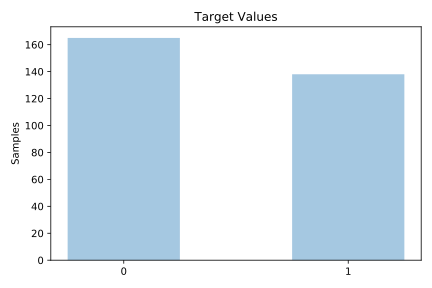
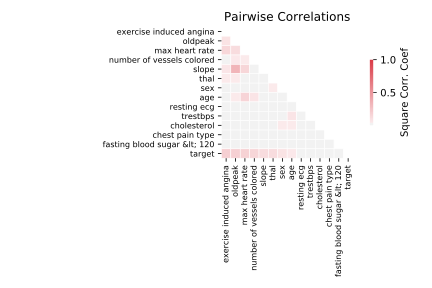

# cleve

[Metadata](metadata.yaml) | [Summary Statistics](summary_stats.csv)

## Summary

**task**: classification

**instances**: 303

**features**: 13

**number of classes**: 13

## Summary Plots

## Data Summary

|	variable	|	count	|	mean	|	std	|	min	|	25%	|	50%	|	75%	|	max|
| --- | --- | --- | --- | --- | --- | --- | --- | --- |
|	Age	|	303	|	54	|	9	|	29	|	47	|	55	|	61	|	77
|	Sex	|	303	|	0	|	0	|	0	|	0	|	1	|	1	|	1
|	Chest pain type	|	303	|	1	|	1	|	0	|	2	|	2	|	3	|	3
|	Trestbps	|	303	|	131	|	17	|	94	|	120	|	130	|	140	|	200
|	Cholesterol	|	303	|	246	|	51	|	126	|	211	|	240	|	274	|	564
|	Fasting blood sugar &lt; 120	|	303	|	0	|	0	|	0	|	0	|	0	|	0	|	1
|	Resting ecg	|	303	|	1	|	0	|	0	|	1	|	2	|	2	|	2
|	Max heart rate	|	303	|	149	|	22	|	71	|	133	|	153	|	166	|	202
|	Exercise induced angina	|	303	|	0	|	0	|	0	|	0	|	0	|	1	|	1
|	Oldpeak	|	303	|	1	|	1	|	0	|	0	|	0	|	1	|	6
|	Slope	|	303	|	1	|	0	|	0	|	1	|	1	|	2	|	2
|	Number of vessels colored	|	303	|	0	|	1	|	0	|	0	|	0	|	1	|	4
|	Thal	|	303	|	2	|	0	|	0	|	2	|	2	|	3	|	3
|	target	|	303	|	0	|	0	|	0	|	0	|	0	|	1	|	1
