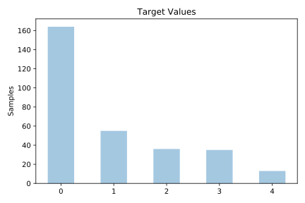
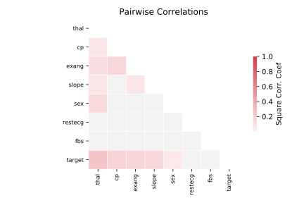

# cleveland_nominal

[Metadata](metadata.yaml) | [Summary Statistics](summary_stats.csv)

## Summary

**task**: classification

**instances**: 303

**features**: 7

**number of classes**: 7

## Summary Plots

## Data Summary

|	variable	|	count	|	mean	|	std	|	min	|	25%	|	50%	|	75%	|	max|
| --- | --- | --- | --- | --- | --- | --- | --- | --- |
|	sex	|	303	|	0	|	0	|	0	|	0	|	1	|	1	|	1
|	cp	|	303	|	3	|	0	|	1	|	3	|	3	|	4	|	4
|	fbs	|	303	|	0	|	0	|	0	|	0	|	0	|	0	|	1
|	restecg	|	303	|	0	|	0	|	0	|	0	|	1	|	2	|	2
|	exang	|	303	|	0	|	0	|	0	|	0	|	0	|	1	|	1
|	slope	|	303	|	1	|	0	|	1	|	1	|	2	|	2	|	3
|	thal	|	303	|	0	|	0	|	0	|	0	|	0	|	2	|	3
|	target	|	303	|	0	|	1	|	0	|	0	|	0	|	2	|	4
