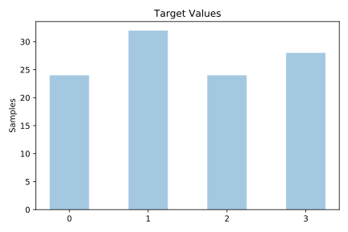
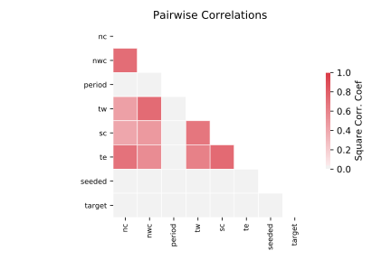

# cloud

[Metadata](metadata.yaml) | [Summary Statistics](summary_stats.csv)

## Summary

**task**: classification

**instances**: 108

**features**: 7

**number of classes**: 7

## Summary Plots

## Data Summary

|	variable	|	count	|	mean	|	std	|	min	|	25%	|	50%	|	75%	|	max|
| --- | --- | --- | --- | --- | --- | --- | --- | --- |
|	PERIOD	|	108	|	100	|	58	|	1	|	55	|	106	|	133	|	194
|	SEEDED	|	108	|	0	|	0	|	0	|	0	|	0	|	1	|	1
|	TE	|	108	|	1	|	1	|	0	|	0	|	0	|	1	|	6
|	TW	|	108	|	2	|	1	|	0	|	0	|	1	|	3	|	6
|	NC	|	108	|	1	|	1	|	0	|	0	|	1	|	2	|	9
|	SC	|	108	|	1	|	0	|	0	|	0	|	0	|	1	|	4
|	NWC	|	108	|	2	|	1	|	0	|	0	|	1	|	3	|	7
|	target	|	108	|	1	|	1	|	0	|	1	|	1	|	3	|	3
