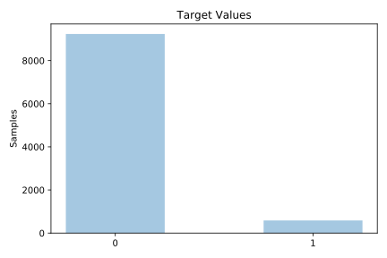
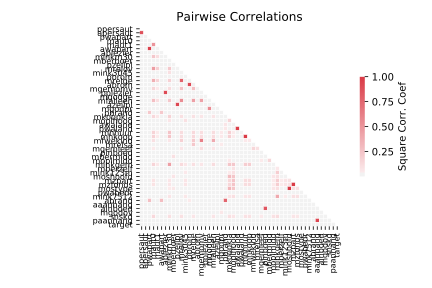

# coil2000

[Metadata](metadata.yaml) | [Summary Statistics](summary_stats.csv)

## Summary

**task**: classification

**instances**: 9822

**features**: 85

**number of classes**: 85

## Summary Plots

## Data Summary

|	variable	|	count	|	mean	|	std	|	min	|	25%	|	50%	|	75%	|	max|
| --- | --- | --- | --- | --- | --- | --- | --- | --- |
|	MOSTYPE	|	9822	|	24	|	12	|	1	|	10	|	30	|	35	|	41
|	MAANTHUI	|	9822	|	1	|	0	|	1	|	1	|	1	|	1	|	10
|	MGEMOMV	|	9822	|	2	|	0	|	1	|	2	|	3	|	3	|	6
|	MGEMLEEF	|	9822	|	2	|	0	|	1	|	2	|	3	|	3	|	6
|	MOSHOOFD	|	9822	|	5	|	2	|	1	|	3	|	7	|	8	|	10
|	MGODRK	|	9822	|	0	|	1	|	0	|	0	|	0	|	1	|	9
|	MGODPR	|	9822	|	4	|	1	|	0	|	4	|	5	|	6	|	9
|	MGODOV	|	9822	|	1	|	1	|	0	|	0	|	1	|	2	|	5
|	MGODGE	|	9822	|	3	|	1	|	0	|	2	|	3	|	4	|	9
|	MRELGE	|	9822	|	6	|	1	|	0	|	5	|	6	|	7	|	9
|	MRELSA	|	9822	|	0	|	0	|	0	|	0	|	1	|	1	|	7
|	MRELOV	|	9822	|	2	|	1	|	0	|	1	|	2	|	3	|	9
|	MFALLEEN	|	9822	|	1	|	1	|	0	|	0	|	2	|	3	|	9
|	MFGEKIND	|	9822	|	3	|	1	|	0	|	2	|	3	|	4	|	9
|	MFWEKIND	|	9822	|	4	|	1	|	0	|	3	|	4	|	6	|	9
|	MOPLHOOG	|	9822	|	1	|	1	|	0	|	0	|	1	|	2	|	9
|	MOPLMIDD	|	9822	|	3	|	1	|	0	|	2	|	3	|	4	|	9
|	MOPLLAAG	|	9822	|	4	|	2	|	0	|	3	|	5	|	6	|	9
|	MBERHOOG	|	9822	|	1	|	1	|	0	|	0	|	2	|	3	|	9
|	MBERZELF	|	9822	|	0	|	0	|	0	|	0	|	0	|	1	|	5
|	MBERBOER	|	9822	|	0	|	1	|	0	|	0	|	0	|	1	|	9
|	MBERMIDD	|	9822	|	2	|	1	|	0	|	2	|	3	|	4	|	9
|	MBERARBG	|	9822	|	2	|	1	|	0	|	1	|	2	|	3	|	9
|	MBERARBO	|	9822	|	2	|	1	|	0	|	1	|	2	|	3	|	9
|	MSKA	|	9822	|	1	|	1	|	0	|	0	|	1	|	2	|	9
|	MSKB1	|	9822	|	1	|	1	|	0	|	1	|	2	|	2	|	9
|	MSKB2	|	9822	|	2	|	1	|	0	|	1	|	2	|	3	|	9
|	MSKC	|	9822	|	3	|	1	|	0	|	2	|	4	|	5	|	9
|	MSKD	|	9822	|	1	|	1	|	0	|	0	|	1	|	2	|	9
|	MHHUUR	|	9822	|	4	|	3	|	0	|	2	|	4	|	7	|	9
|	MHKOOP	|	9822	|	4	|	3	|	0	|	2	|	5	|	7	|	9
|	MAUT1	|	9822	|	6	|	1	|	0	|	5	|	6	|	7	|	9
|	MAUT2	|	9822	|	1	|	1	|	0	|	0	|	1	|	2	|	9
|	MAUT0	|	9822	|	1	|	1	|	0	|	0	|	2	|	3	|	9
|	MZFONDS	|	9822	|	6	|	2	|	0	|	5	|	7	|	8	|	9
|	MZPART	|	9822	|	2	|	2	|	0	|	1	|	2	|	4	|	9
|	MINKM30	|	9822	|	2	|	2	|	0	|	1	|	2	|	4	|	9
|	MINK3045	|	9822	|	3	|	1	|	0	|	2	|	4	|	5	|	9
|	MINK4575	|	9822	|	2	|	1	|	0	|	1	|	3	|	4	|	9
|	MINK7512	|	9822	|	0	|	1	|	0	|	0	|	0	|	1	|	9
|	MINK123M	|	9822	|	0	|	0	|	0	|	0	|	0	|	0	|	9
|	MINKGEM	|	9822	|	3	|	1	|	0	|	3	|	4	|	4	|	9
|	MKOOPKLA	|	9822	|	4	|	1	|	1	|	3	|	4	|	6	|	8
|	PWAPART	|	9822	|	0	|	0	|	0	|	0	|	0	|	2	|	3
|	PWABEDR	|	9822	|	0	|	0	|	0	|	0	|	0	|	0	|	6
|	PWALAND	|	9822	|	0	|	0	|	0	|	0	|	0	|	0	|	4
|	PPERSAUT	|	9822	|	2	|	2	|	0	|	0	|	5	|	6	|	9
|	PBESAUT	|	9822	|	0	|	0	|	0	|	0	|	0	|	0	|	7
|	PMOTSCO	|	9822	|	0	|	0	|	0	|	0	|	0	|	0	|	7
|	PVRAAUT	|	9822	|	0	|	0	|	0	|	0	|	0	|	0	|	9
|	PAANHANG	|	9822	|	0	|	0	|	0	|	0	|	0	|	0	|	5
|	PTRACTOR	|	9822	|	0	|	0	|	0	|	0	|	0	|	0	|	7
|	PWERKT	|	9822	|	0	|	0	|	0	|	0	|	0	|	0	|	6
|	PBROM	|	9822	|	0	|	0	|	0	|	0	|	0	|	0	|	6
|	PLEVEN	|	9822	|	0	|	0	|	0	|	0	|	0	|	0	|	9
|	PPERSONG	|	9822	|	0	|	0	|	0	|	0	|	0	|	0	|	6
|	PGEZONG	|	9822	|	0	|	0	|	0	|	0	|	0	|	0	|	3
|	PWAOREG	|	9822	|	0	|	0	|	0	|	0	|	0	|	0	|	7
|	PBRAND	|	9822	|	1	|	1	|	0	|	0	|	2	|	4	|	8
|	PZEILPL	|	9822	|	0	|	0	|	0	|	0	|	0	|	0	|	3
|	PPLEZIER	|	9822	|	0	|	0	|	0	|	0	|	0	|	0	|	6
|	PFIETS	|	9822	|	0	|	0	|	0	|	0	|	0	|	0	|	1
|	PINBOED	|	9822	|	0	|	0	|	0	|	0	|	0	|	0	|	6
|	PBYSTAND	|	9822	|	0	|	0	|	0	|	0	|	0	|	0	|	5
|	AWAPART	|	9822	|	0	|	0	|	0	|	0	|	0	|	1	|	2
|	AWABEDR	|	9822	|	0	|	0	|	0	|	0	|	0	|	0	|	5
|	AWALAND	|	9822	|	0	|	0	|	0	|	0	|	0	|	0	|	1
|	APERSAUT	|	9822	|	0	|	0	|	0	|	0	|	1	|	1	|	12
|	ABESAUT	|	9822	|	0	|	0	|	0	|	0	|	0	|	0	|	5
|	AMOTSCO	|	9822	|	0	|	0	|	0	|	0	|	0	|	0	|	8
|	AVRAAUT	|	9822	|	0	|	0	|	0	|	0	|	0	|	0	|	4
|	AAANHANG	|	9822	|	0	|	0	|	0	|	0	|	0	|	0	|	3
|	ATRACTOR	|	9822	|	0	|	0	|	0	|	0	|	0	|	0	|	6
|	AWERKT	|	9822	|	0	|	0	|	0	|	0	|	0	|	0	|	6
|	ABROM	|	9822	|	0	|	0	|	0	|	0	|	0	|	0	|	3
|	ALEVEN	|	9822	|	0	|	0	|	0	|	0	|	0	|	0	|	8
|	APERSONG	|	9822	|	0	|	0	|	0	|	0	|	0	|	0	|	1
|	AGEZONG	|	9822	|	0	|	0	|	0	|	0	|	0	|	0	|	1
|	AWAOREG	|	9822	|	0	|	0	|	0	|	0	|	0	|	0	|	2
|	ABRAND	|	9822	|	0	|	0	|	0	|	0	|	1	|	1	|	7
|	AZEILPL	|	9822	|	0	|	0	|	0	|	0	|	0	|	0	|	1
|	APLEZIER	|	9822	|	0	|	0	|	0	|	0	|	0	|	0	|	2
|	AFIETS	|	9822	|	0	|	0	|	0	|	0	|	0	|	0	|	4
|	AINBOED	|	9822	|	0	|	0	|	0	|	0	|	0	|	0	|	2
|	ABYSTAND	|	9822	|	0	|	0	|	0	|	0	|	0	|	0	|	2
|	target	|	9822	|	0	|	0	|	0	|	0	|	0	|	0	|	1
