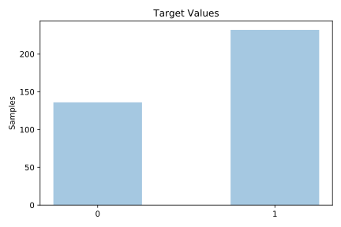
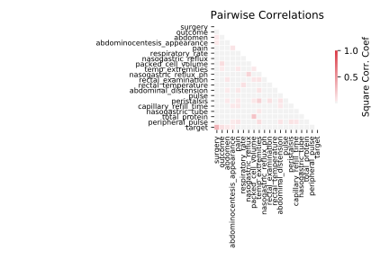

# colic

[Metadata](metadata.yaml) | [Summary Statistics](summary_stats.csv)

## Summary

**task**: classification

**instances**: 368

**features**: 22

**number of classes**: 22

## Summary Plots

## Data Summary

|	variable	|	count	|	mean	|	std	|	min	|	25%	|	50%	|	75%	|	max|
| --- | --- | --- | --- | --- | --- | --- | --- | --- |
|	surgery	|	368	|	1	|	0	|	0	|	1	|	2	|	2	|	2
|	Age	|	368	|	0	|	0	|	0	|	0	|	0	|	0	|	1
|	rectal_temperature	|	368	|	23	|	10	|	0	|	16	|	21	|	30	|	40
|	pulse	|	368	|	31	|	14	|	0	|	24	|	32	|	43	|	54
|	respiratory_rate	|	368	|	18	|	13	|	0	|	7	|	15	|	29	|	40
|	temp_extremities	|	368	|	2	|	1	|	0	|	1	|	2	|	3	|	4
|	peripheral_pulse	|	368	|	2	|	1	|	0	|	1	|	3	|	4	|	4
|	mucous_membranes	|	368	|	3	|	2	|	0	|	2	|	4	|	5	|	6
|	capillary_refill_time	|	368	|	0	|	0	|	0	|	0	|	1	|	1	|	3
|	pain	|	368	|	2	|	1	|	0	|	1	|	3	|	4	|	5
|	peristalsis	|	368	|	2	|	1	|	0	|	1	|	2	|	3	|	4
|	abdominal_distension	|	368	|	1	|	1	|	0	|	1	|	2	|	3	|	4
|	nasogastric_tube	|	368	|	1	|	1	|	0	|	0	|	1	|	3	|	3
|	nasogastric_reflux	|	368	|	2	|	1	|	0	|	1	|	2	|	3	|	3
|	nasogastric_reflux_PH	|	368	|	21	|	5	|	0	|	24	|	24	|	24	|	24
|	rectal_examination	|	368	|	1	|	1	|	0	|	0	|	1	|	2	|	4
|	abdomen	|	368	|	1	|	1	|	0	|	0	|	1	|	2	|	5
|	packed_cell_volume	|	368	|	26	|	13	|	0	|	15	|	23	|	35	|	54
|	total_protein	|	368	|	46	|	22	|	0	|	30	|	44	|	62	|	84
|	abdominocentesis_appearance	|	368	|	0	|	1	|	0	|	0	|	0	|	2	|	3
|	abdomcentesis_total_protein	|	368	|	34	|	15	|	0	|	23	|	44	|	44	|	44
|	outcome	|	368	|	2	|	0	|	0	|	2	|	3	|	3	|	3
|	target	|	368	|	0	|	0	|	0	|	0	|	1	|	1	|	1
