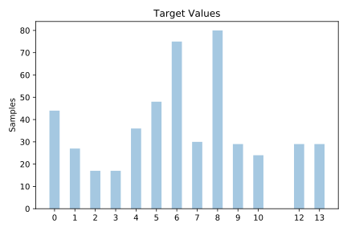
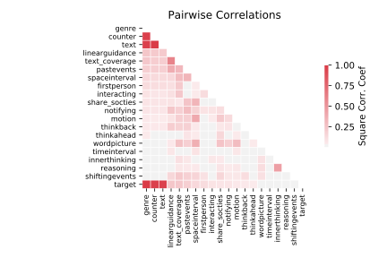

# collins

[Metadata](metadata.yaml) | [Summary Statistics](summary_stats.csv)

## Summary

**task**: classification

**instances**: 485

**features**: 23

**number of classes**: 23

## Summary Plots

## Data Summary

|	variable	|	count	|	mean	|	std	|	min	|	25%	|	50%	|	75%	|	max|
| --- | --- | --- | --- | --- | --- | --- | --- | --- |
|	Text	|	485	|	242	|	141	|	0	|	121	|	242	|	363	|	490
|	FirstPerson	|	485	|	0	|	0	|	0	|	0	|	0	|	0	|	5
|	InnerThinking	|	485	|	2	|	0	|	0	|	2	|	2	|	3	|	6
|	ThinkPositive	|	485	|	0	|	0	|	0	|	0	|	0	|	0	|	2
|	ThinkNegative	|	485	|	1	|	0	|	0	|	0	|	1	|	1	|	3
|	ThinkAhead	|	485	|	1	|	0	|	0	|	0	|	1	|	1	|	3
|	ThinkBack	|	485	|	0	|	0	|	0	|	0	|	0	|	0	|	1
|	Reasoning	|	485	|	2	|	0	|	0	|	1	|	2	|	3	|	5
|	Share_SocTies	|	485	|	2	|	1	|	0	|	1	|	1	|	2	|	5
|	Direct_Activity	|	485	|	0	|	0	|	0	|	0	|	0	|	0	|	3
|	Interacting	|	485	|	0	|	0	|	0	|	0	|	0	|	0	|	7
|	Notifying	|	485	|	2	|	0	|	1	|	2	|	2	|	3	|	5
|	LinearGuidance	|	485	|	4	|	2	|	0	|	3	|	4	|	6	|	10
|	WordPicture	|	485	|	5	|	2	|	0	|	3	|	5	|	6	|	14
|	SpaceInterval	|	485	|	1	|	0	|	0	|	0	|	1	|	1	|	3
|	Motion	|	485	|	0	|	0	|	0	|	0	|	0	|	0	|	2
|	PastEvents	|	485	|	2	|	1	|	0	|	1	|	1	|	2	|	5
|	TimeInterval	|	485	|	1	|	0	|	0	|	0	|	1	|	1	|	4
|	ShiftingEvents	|	485	|	0	|	0	|	0	|	0	|	0	|	1	|	1
|	Text_Coverage	|	485	|	31	|	5	|	16	|	27	|	31	|	35	|	42
|	Genre	|	485	|	7	|	3	|	1	|	5	|	7	|	9	|	14
|	Counter	|	485	|	243	|	141	|	1	|	122	|	243	|	364	|	491
|	Corpus	|	485	|	1	|	0	|	1	|	1	|	1	|	1	|	1
|	target	|	485	|	6	|	3	|	0	|	4	|	6	|	8	|	13
