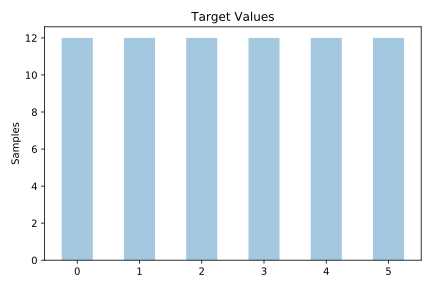
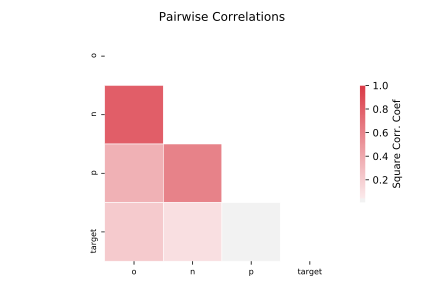

# confidence

[Metadata](metadata.yaml) | [Summary Statistics](summary_stats.csv)

## Summary

**task**: classification

**instances**: 72

**features**: 3

**number of classes**: 3

## Summary Plots

## Data Summary

|	variable	|	count	|	mean	|	std	|	min	|	25%	|	50%	|	75%	|	max|
| --- | --- | --- | --- | --- | --- | --- | --- | --- |
|	P	|	72	|	338	|	263	|	50	|	89	|	309	|	474	|	1051
|	N	|	72	|	1184	|	1005	|	120	|	209	|	1067	|	2171	|	2567
|	O	|	72	|	400	|	250	|	45	|	150	|	359	|	620	|	899
|	target	|	72	|	2	|	1	|	0	|	1	|	2	|	4	|	5
