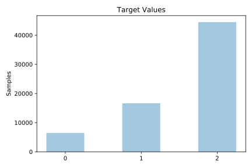
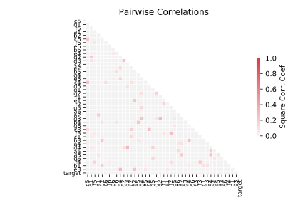

# connect_4

[Metadata](metadata.yaml) | [Summary Statistics](summary_stats.csv)

## Summary

**task**: classification

**instances**: 67557

**features**: 42

**number of classes**: 42

## Summary Plots

## Data Summary

|	variable	|	count	|	mean	|	std	|	min	|	25%	|	50%	|	75%	|	max|
| --- | --- | --- | --- | --- | --- | --- | --- | --- |
|	a1	|	67557	|	0	|	0	|	0	|	0	|	1	|	2	|	2
|	a2	|	67557	|	0	|	0	|	0	|	0	|	0	|	1	|	2
|	a3	|	67557	|	0	|	0	|	0	|	0	|	0	|	0	|	2
|	a4	|	67557	|	0	|	0	|	0	|	0	|	0	|	0	|	2
|	a5	|	67557	|	0	|	0	|	0	|	0	|	0	|	0	|	2
|	a6	|	67557	|	0	|	0	|	0	|	0	|	0	|	0	|	2
|	b1	|	67557	|	1	|	0	|	0	|	0	|	1	|	2	|	2
|	b2	|	67557	|	0	|	0	|	0	|	0	|	0	|	1	|	2
|	b3	|	67557	|	0	|	0	|	0	|	0	|	0	|	0	|	2
|	b4	|	67557	|	0	|	0	|	0	|	0	|	0	|	0	|	2
|	b5	|	67557	|	0	|	0	|	0	|	0	|	0	|	0	|	2
|	b6	|	67557	|	0	|	0	|	0	|	0	|	0	|	0	|	2
|	c1	|	67557	|	1	|	0	|	0	|	1	|	1	|	2	|	2
|	c2	|	67557	|	0	|	0	|	0	|	0	|	0	|	1	|	2
|	c3	|	67557	|	0	|	0	|	0	|	0	|	0	|	0	|	2
|	c4	|	67557	|	0	|	0	|	0	|	0	|	0	|	0	|	2
|	c5	|	67557	|	0	|	0	|	0	|	0	|	0	|	0	|	2
|	c6	|	67557	|	0	|	0	|	0	|	0	|	0	|	0	|	2
|	d1	|	67557	|	0	|	0	|	0	|	0	|	1	|	2	|	2
|	d2	|	67557	|	0	|	0	|	0	|	0	|	0	|	1	|	2
|	d3	|	67557	|	0	|	0	|	0	|	0	|	0	|	0	|	2
|	d4	|	67557	|	0	|	0	|	0	|	0	|	0	|	0	|	2
|	d5	|	67557	|	0	|	0	|	0	|	0	|	0	|	0	|	2
|	d6	|	67557	|	0	|	0	|	0	|	0	|	0	|	0	|	2
|	e1	|	67557	|	0	|	0	|	0	|	0	|	0	|	1	|	2
|	e2	|	67557	|	0	|	0	|	0	|	0	|	0	|	0	|	2
|	e3	|	67557	|	0	|	0	|	0	|	0	|	0	|	0	|	2
|	e4	|	67557	|	0	|	0	|	0	|	0	|	0	|	0	|	2
|	e5	|	67557	|	0	|	0	|	0	|	0	|	0	|	0	|	2
|	e6	|	67557	|	0	|	0	|	0	|	0	|	0	|	0	|	2
|	f1	|	67557	|	0	|	0	|	0	|	0	|	0	|	1	|	2
|	f2	|	67557	|	0	|	0	|	0	|	0	|	0	|	0	|	2
|	f3	|	67557	|	0	|	0	|	0	|	0	|	0	|	0	|	2
|	f4	|	67557	|	0	|	0	|	0	|	0	|	0	|	0	|	2
|	f5	|	67557	|	0	|	0	|	0	|	0	|	0	|	0	|	2
|	f6	|	67557	|	0	|	0	|	0	|	0	|	0	|	0	|	2
|	g1	|	67557	|	0	|	0	|	0	|	0	|	1	|	2	|	2
|	g2	|	67557	|	0	|	0	|	0	|	0	|	0	|	1	|	2
|	g3	|	67557	|	0	|	0	|	0	|	0	|	0	|	0	|	2
|	g4	|	67557	|	0	|	0	|	0	|	0	|	0	|	0	|	2
|	g5	|	67557	|	0	|	0	|	0	|	0	|	0	|	0	|	2
|	g6	|	67557	|	0	|	0	|	0	|	0	|	0	|	0	|	2
|	target	|	67557	|	1	|	0	|	0	|	1	|	2	|	2	|	2
