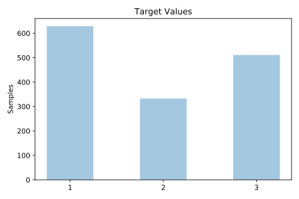
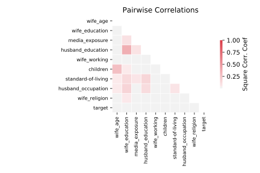

# contraceptive

[Metadata](metadata.yaml) | [Summary Statistics](summary_stats.csv)

## Summary

**task**: classification

**instances**: 1473

**features**: 9

**number of classes**: 9

## Summary Plots

## Data Summary

|	variable	|	count	|	mean	|	std	|	min	|	25%	|	50%	|	75%	|	max|
| --- | --- | --- | --- | --- | --- | --- | --- | --- |
|	Wife_age	|	1473	|	32	|	8	|	16	|	26	|	32	|	39	|	49
|	Wife_education	|	1473	|	2	|	1	|	1	|	2	|	3	|	4	|	4
|	Husband_education	|	1473	|	3	|	0	|	1	|	3	|	4	|	4	|	4
|	Children	|	1473	|	3	|	2	|	0	|	1	|	3	|	4	|	16
|	Wife_religion	|	1473	|	0	|	0	|	0	|	1	|	1	|	1	|	1
|	Wife_working	|	1473	|	0	|	0	|	0	|	0	|	1	|	1	|	1
|	Husband_occupation	|	1473	|	2	|	0	|	1	|	1	|	2	|	3	|	4
|	Standard-of-living	|	1473	|	3	|	0	|	1	|	3	|	3	|	4	|	4
|	Media_exposure	|	1473	|	0	|	0	|	0	|	0	|	0	|	0	|	1
|	target	|	1473	|	1	|	0	|	1	|	1	|	2	|	3	|	3
