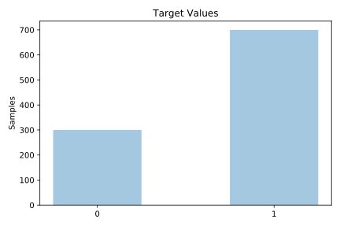
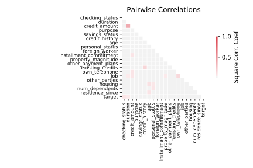

# credit_g

[Metadata](metadata.yaml) | [Summary Statistics](summary_stats.csv)

## Summary

**task**: classification

**instances**: 1000

**features**: 20

**number of classes**: 20

## Summary Plots

## Data Summary

|	variable	|	count	|	mean	|	std	|	min	|	25%	|	50%	|	75%	|	max|
| --- | --- | --- | --- | --- | --- | --- | --- | --- |
|	checking_status	|	1000	|	1	|	0	|	0	|	1	|	2	|	3	|	3
|	duration	|	1000	|	20	|	12	|	4	|	12	|	18	|	24	|	72
|	credit_history	|	1000	|	2	|	1	|	0	|	1	|	3	|	3	|	4
|	purpose	|	1000	|	4	|	2	|	0	|	3	|	4	|	6	|	9
|	credit_amount	|	1000	|	3271	|	2822	|	250	|	1365	|	2319	|	3972	|	18424
|	savings_status	|	1000	|	1	|	1	|	0	|	1	|	1	|	2	|	4
|	employment	|	1000	|	1	|	1	|	0	|	0	|	2	|	2	|	4
|	installment_commitment	|	1000	|	2	|	1	|	1	|	2	|	3	|	4	|	4
|	personal_status	|	1000	|	1	|	1	|	0	|	0	|	3	|	3	|	3
|	other_parties	|	1000	|	1	|	0	|	0	|	2	|	2	|	2	|	2
|	residence_since	|	1000	|	2	|	1	|	1	|	2	|	3	|	4	|	4
|	property_magnitude	|	1000	|	1	|	1	|	0	|	0	|	1	|	3	|	3
|	age	|	1000	|	35	|	11	|	19	|	27	|	33	|	42	|	75
|	other_payment_plans	|	1000	|	0	|	0	|	0	|	1	|	1	|	1	|	2
|	housing	|	1000	|	1	|	0	|	0	|	1	|	1	|	1	|	2
|	existing_credits	|	1000	|	1	|	0	|	1	|	1	|	1	|	2	|	4
|	job	|	1000	|	1	|	0	|	0	|	1	|	1	|	1	|	3
|	num_dependents	|	1000	|	1	|	0	|	1	|	1	|	1	|	1	|	2
|	own_telephone	|	1000	|	0	|	0	|	0	|	0	|	0	|	1	|	1
|	foreign_worker	|	1000	|	0	|	0	|	0	|	1	|	1	|	1	|	1
|	target	|	1000	|	0	|	0	|	0	|	0	|	1	|	1	|	1
