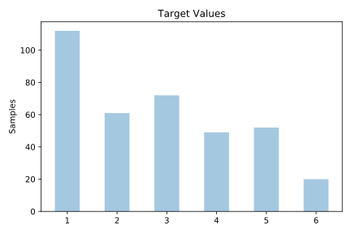
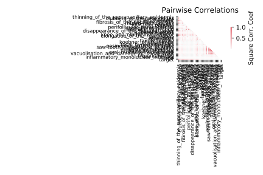

# dermatology

[Metadata](metadata.yaml) | [Summary Statistics](summary_stats.csv)

## Summary

**task**: classification

**instances**: 366

**features**: 34

**number of classes**: 34

## Summary Plots

## Data Summary

|	variable	|	count	|	mean	|	std	|	min	|	25%	|	50%	|	75%	|	max|
| --- | --- | --- | --- | --- | --- | --- | --- | --- |
|	erythema	|	366	|	2	|	0	|	0	|	2	|	2	|	2	|	3
|	scaling	|	366	|	1	|	0	|	0	|	1	|	2	|	2	|	3
|	definite_borders	|	366	|	1	|	0	|	0	|	1	|	2	|	2	|	3
|	itching	|	366	|	1	|	1	|	0	|	0	|	1	|	2	|	3
|	koebner_phenomenon	|	366	|	0	|	0	|	0	|	0	|	0	|	1	|	3
|	polygonal_papules	|	366	|	0	|	0	|	0	|	0	|	0	|	0	|	3
|	follicular_papules	|	366	|	0	|	0	|	0	|	0	|	0	|	0	|	3
|	oral_mucosal_involvement	|	366	|	0	|	0	|	0	|	0	|	0	|	0	|	3
|	knee_and_elbow_involvement	|	366	|	0	|	0	|	0	|	0	|	0	|	1	|	3
|	scalp_involvement	|	366	|	0	|	0	|	0	|	0	|	0	|	1	|	3
|	family_history	|	366	|	0	|	0	|	0	|	0	|	0	|	0	|	1
|	melanin_incontinence	|	366	|	0	|	0	|	0	|	0	|	0	|	0	|	3
|	eosinophils_in_the_infiltrate	|	366	|	0	|	0	|	0	|	0	|	0	|	0	|	2
|	PNL_infiltrate	|	366	|	0	|	0	|	0	|	0	|	0	|	1	|	3
|	fibrosis_of_the_papillary_dermis	|	366	|	0	|	0	|	0	|	0	|	0	|	0	|	3
|	exocytosis	|	366	|	1	|	1	|	0	|	0	|	2	|	2	|	3
|	acanthosis	|	366	|	1	|	0	|	0	|	2	|	2	|	2	|	3
|	hyperkeratosis	|	366	|	0	|	0	|	0	|	0	|	0	|	1	|	3
|	parakeratosis	|	366	|	1	|	0	|	0	|	1	|	1	|	2	|	3
|	clubbing_of_the_rete_ridges	|	366	|	0	|	1	|	0	|	0	|	0	|	2	|	3
|	elongation_of_the_rete_ridges	|	366	|	0	|	1	|	0	|	0	|	0	|	2	|	3
|	thinning_of_the_suprapapillary_epidermis	|	366	|	0	|	1	|	0	|	0	|	0	|	1	|	3
|	spongiform_pustule	|	366	|	0	|	0	|	0	|	0	|	0	|	0	|	3
|	munro_microabcess	|	366	|	0	|	0	|	0	|	0	|	0	|	0	|	3
|	focal_hypergranulosis	|	366	|	0	|	0	|	0	|	0	|	0	|	0	|	3
|	disappearance_of_the_granular_layer	|	366	|	0	|	0	|	0	|	0	|	0	|	1	|	3
|	vacuolisation_and_damage_of_basal_layer	|	366	|	0	|	0	|	0	|	0	|	0	|	0	|	3
|	spongiosis	|	366	|	0	|	1	|	0	|	0	|	0	|	2	|	3
|	saw-tooth_appearance_of_retes	|	366	|	0	|	0	|	0	|	0	|	0	|	0	|	3
|	follicular_horn_plug	|	366	|	0	|	0	|	0	|	0	|	0	|	0	|	3
|	perifollicular_parakeratosis	|	366	|	0	|	0	|	0	|	0	|	0	|	0	|	3
|	inflammatory_monoluclear_inflitrate	|	366	|	1	|	0	|	0	|	1	|	2	|	2	|	3
|	band-like_infiltrate	|	366	|	0	|	1	|	0	|	0	|	0	|	0	|	3
|	Age	|	366	|	28	|	15	|	0	|	16	|	25	|	40	|	60
|	target	|	366	|	2	|	1	|	1	|	1	|	3	|	4	|	6
