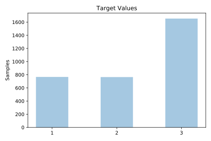
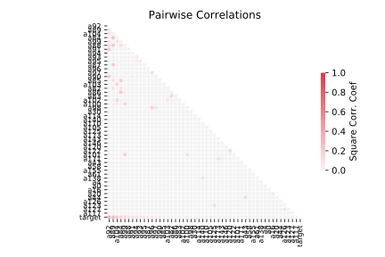

# dna

[Metadata](metadata.yaml) | [Summary Statistics](summary_stats.csv)

## Summary

**task**: classification

**instances**: 3186

**features**: 180

**number of classes**: 180

## Summary Plots

## Data Summary

|	variable	|	count	|	mean	|	std	|	min	|	25%	|	50%	|	75%	|	max|
| --- | --- | --- | --- | --- | --- | --- | --- | --- |
|	A0	|	3186	|	0	|	0	|	0	|	0	|	0	|	0	|	1
|	A1	|	3186	|	0	|	0	|	0	|	0	|	0	|	1	|	1
|	A2	|	3186	|	0	|	0	|	0	|	0	|	0	|	1	|	1
|	A3	|	3186	|	0	|	0	|	0	|	0	|	0	|	0	|	1
|	A4	|	3186	|	0	|	0	|	0	|	0	|	0	|	1	|	1
|	A5	|	3186	|	0	|	0	|	0	|	0	|	0	|	0	|	1
|	A6	|	3186	|	0	|	0	|	0	|	0	|	0	|	0	|	1
|	A7	|	3186	|	0	|	0	|	0	|	0	|	0	|	1	|	1
|	A8	|	3186	|	0	|	0	|	0	|	0	|	0	|	1	|	1
|	A9	|	3186	|	0	|	0	|	0	|	0	|	0	|	0	|	1
|	A10	|	3186	|	0	|	0	|	0	|	0	|	0	|	1	|	1
|	A11	|	3186	|	0	|	0	|	0	|	0	|	0	|	1	|	1
|	A12	|	3186	|	0	|	0	|	0	|	0	|	0	|	1	|	1
|	A13	|	3186	|	0	|	0	|	0	|	0	|	0	|	1	|	1
|	A14	|	3186	|	0	|	0	|	0	|	0	|	0	|	0	|	1
|	A15	|	3186	|	0	|	0	|	0	|	0	|	0	|	0	|	1
|	A16	|	3186	|	0	|	0	|	0	|	0	|	0	|	1	|	1
|	A17	|	3186	|	0	|	0	|	0	|	0	|	0	|	1	|	1
|	A18	|	3186	|	0	|	0	|	0	|	0	|	0	|	0	|	1
|	A19	|	3186	|	0	|	0	|	0	|	0	|	0	|	1	|	1
|	A20	|	3186	|	0	|	0	|	0	|	0	|	0	|	0	|	1
|	A21	|	3186	|	0	|	0	|	0	|	0	|	0	|	0	|	1
|	A22	|	3186	|	0	|	0	|	0	|	0	|	0	|	1	|	1
|	A23	|	3186	|	0	|	0	|	0	|	0	|	0	|	0	|	1
|	A24	|	3186	|	0	|	0	|	0	|	0	|	0	|	0	|	1
|	A25	|	3186	|	0	|	0	|	0	|	0	|	0	|	1	|	1
|	A26	|	3186	|	0	|	0	|	0	|	0	|	0	|	0	|	1
|	A27	|	3186	|	0	|	0	|	0	|	0	|	0	|	0	|	1
|	A28	|	3186	|	0	|	0	|	0	|	0	|	0	|	1	|	1
|	A29	|	3186	|	0	|	0	|	0	|	0	|	0	|	0	|	1
|	A30	|	3186	|	0	|	0	|	0	|	0	|	0	|	0	|	1
|	A31	|	3186	|	0	|	0	|	0	|	0	|	0	|	1	|	1
|	A32	|	3186	|	0	|	0	|	0	|	0	|	0	|	0	|	1
|	A33	|	3186	|	0	|	0	|	0	|	0	|	0	|	0	|	1
|	A34	|	3186	|	0	|	0	|	0	|	0	|	0	|	1	|	1
|	A35	|	3186	|	0	|	0	|	0	|	0	|	0	|	1	|	1
|	A36	|	3186	|	0	|	0	|	0	|	0	|	0	|	0	|	1
|	A37	|	3186	|	0	|	0	|	0	|	0	|	0	|	1	|	1
|	A38	|	3186	|	0	|	0	|	0	|	0	|	0	|	0	|	1
|	A39	|	3186	|	0	|	0	|	0	|	0	|	0	|	0	|	1
|	A40	|	3186	|	0	|	0	|	0	|	0	|	0	|	1	|	1
|	A41	|	3186	|	0	|	0	|	0	|	0	|	0	|	0	|	1
|	A42	|	3186	|	0	|	0	|	0	|	0	|	0	|	0	|	1
|	A43	|	3186	|	0	|	0	|	0	|	0	|	0	|	1	|	1
|	A44	|	3186	|	0	|	0	|	0	|	0	|	0	|	0	|	1
|	A45	|	3186	|	0	|	0	|	0	|	0	|	0	|	0	|	1
|	A46	|	3186	|	0	|	0	|	0	|	0	|	0	|	1	|	1
|	A47	|	3186	|	0	|	0	|	0	|	0	|	0	|	0	|	1
|	A48	|	3186	|	0	|	0	|	0	|	0	|	0	|	0	|	1
|	A49	|	3186	|	0	|	0	|	0	|	0	|	0	|	1	|	1
|	A50	|	3186	|	0	|	0	|	0	|	0	|	0	|	0	|	1
|	A51	|	3186	|	0	|	0	|	0	|	0	|	0	|	0	|	1
|	A52	|	3186	|	0	|	0	|	0	|	0	|	0	|	1	|	1
|	A53	|	3186	|	0	|	0	|	0	|	0	|	0	|	0	|	1
|	A54	|	3186	|	0	|	0	|	0	|	0	|	0	|	0	|	1
|	A55	|	3186	|	0	|	0	|	0	|	0	|	0	|	1	|	1
|	A56	|	3186	|	0	|	0	|	0	|	0	|	0	|	0	|	1
|	A57	|	3186	|	0	|	0	|	0	|	0	|	0	|	0	|	1
|	A58	|	3186	|	0	|	0	|	0	|	0	|	0	|	1	|	1
|	A59	|	3186	|	0	|	0	|	0	|	0	|	0	|	0	|	1
|	A60	|	3186	|	0	|	0	|	0	|	0	|	0	|	0	|	1
|	A61	|	3186	|	0	|	0	|	0	|	0	|	0	|	1	|	1
|	A62	|	3186	|	0	|	0	|	0	|	0	|	0	|	0	|	1
|	A63	|	3186	|	0	|	0	|	0	|	0	|	0	|	0	|	1
|	A64	|	3186	|	0	|	0	|	0	|	0	|	0	|	1	|	1
|	A65	|	3186	|	0	|	0	|	0	|	0	|	0	|	0	|	1
|	A66	|	3186	|	0	|	0	|	0	|	0	|	0	|	0	|	1
|	A67	|	3186	|	0	|	0	|	0	|	0	|	0	|	1	|	1
|	A68	|	3186	|	0	|	0	|	0	|	0	|	0	|	0	|	1
|	A69	|	3186	|	0	|	0	|	0	|	0	|	0	|	0	|	1
|	A70	|	3186	|	0	|	0	|	0	|	0	|	0	|	1	|	1
|	A71	|	3186	|	0	|	0	|	0	|	0	|	0	|	0	|	1
|	A72	|	3186	|	0	|	0	|	0	|	0	|	0	|	0	|	1
|	A73	|	3186	|	0	|	0	|	0	|	0	|	0	|	1	|	1
|	A74	|	3186	|	0	|	0	|	0	|	0	|	0	|	0	|	1
|	A75	|	3186	|	0	|	0	|	0	|	0	|	0	|	0	|	1
|	A76	|	3186	|	0	|	0	|	0	|	0	|	0	|	1	|	1
|	A77	|	3186	|	0	|	0	|	0	|	0	|	0	|	0	|	1
|	A78	|	3186	|	0	|	0	|	0	|	0	|	0	|	0	|	1
|	A79	|	3186	|	0	|	0	|	0	|	0	|	0	|	1	|	1
|	A80	|	3186	|	0	|	0	|	0	|	0	|	0	|	1	|	1
|	A81	|	3186	|	0	|	0	|	0	|	0	|	0	|	0	|	1
|	A82	|	3186	|	0	|	0	|	0	|	0	|	0	|	1	|	1
|	A83	|	3186	|	0	|	0	|	0	|	0	|	0	|	0	|	1
|	A84	|	3186	|	0	|	0	|	0	|	0	|	1	|	1	|	1
|	A85	|	3186	|	0	|	0	|	0	|	0	|	0	|	0	|	1
|	A86	|	3186	|	0	|	0	|	0	|	0	|	0	|	0	|	1
|	A87	|	3186	|	0	|	0	|	0	|	0	|	0	|	0	|	1
|	A88	|	3186	|	0	|	0	|	0	|	0	|	0	|	0	|	1
|	A89	|	3186	|	0	|	0	|	0	|	0	|	1	|	1	|	1
|	A90	|	3186	|	0	|	0	|	0	|	0	|	0	|	0	|	1
|	A91	|	3186	|	0	|	0	|	0	|	0	|	0	|	0	|	1
|	A92	|	3186	|	0	|	0	|	0	|	0	|	0	|	1	|	1
|	A93	|	3186	|	0	|	0	|	0	|	0	|	0	|	0	|	1
|	A94	|	3186	|	0	|	0	|	0	|	0	|	0	|	0	|	1
|	A95	|	3186	|	0	|	0	|	0	|	0	|	0	|	0	|	1
|	A96	|	3186	|	0	|	0	|	0	|	0	|	0	|	1	|	1
|	A97	|	3186	|	0	|	0	|	0	|	0	|	0	|	0	|	1
|	A98	|	3186	|	0	|	0	|	0	|	0	|	0	|	1	|	1
|	A99	|	3186	|	0	|	0	|	0	|	0	|	0	|	1	|	1
|	A100	|	3186	|	0	|	0	|	0	|	0	|	0	|	0	|	1
|	A101	|	3186	|	0	|	0	|	0	|	0	|	0	|	0	|	1
|	A102	|	3186	|	0	|	0	|	0	|	0	|	0	|	0	|	1
|	A103	|	3186	|	0	|	0	|	0	|	0	|	0	|	0	|	1
|	A104	|	3186	|	0	|	0	|	0	|	0	|	0	|	1	|	1
|	A105	|	3186	|	0	|	0	|	0	|	0	|	0	|	0	|	1
|	A106	|	3186	|	0	|	0	|	0	|	0	|	0	|	1	|	1
|	A107	|	3186	|	0	|	0	|	0	|	0	|	0	|	0	|	1
|	A108	|	3186	|	0	|	0	|	0	|	0	|	0	|	1	|	1
|	A109	|	3186	|	0	|	0	|	0	|	0	|	0	|	0	|	1
|	A110	|	3186	|	0	|	0	|	0	|	0	|	0	|	1	|	1
|	A111	|	3186	|	0	|	0	|	0	|	0	|	0	|	0	|	1
|	A112	|	3186	|	0	|	0	|	0	|	0	|	0	|	1	|	1
|	A113	|	3186	|	0	|	0	|	0	|	0	|	0	|	1	|	1
|	A114	|	3186	|	0	|	0	|	0	|	0	|	0	|	0	|	1
|	A115	|	3186	|	0	|	0	|	0	|	0	|	0	|	1	|	1
|	A116	|	3186	|	0	|	0	|	0	|	0	|	0	|	1	|	1
|	A117	|	3186	|	0	|	0	|	0	|	0	|	0	|	0	|	1
|	A118	|	3186	|	0	|	0	|	0	|	0	|	0	|	1	|	1
|	A119	|	3186	|	0	|	0	|	0	|	0	|	0	|	1	|	1
|	A120	|	3186	|	0	|	0	|	0	|	0	|	0	|	0	|	1
|	A121	|	3186	|	0	|	0	|	0	|	0	|	0	|	0	|	1
|	A122	|	3186	|	0	|	0	|	0	|	0	|	0	|	1	|	1
|	A123	|	3186	|	0	|	0	|	0	|	0	|	0	|	0	|	1
|	A124	|	3186	|	0	|	0	|	0	|	0	|	0	|	1	|	1
|	A125	|	3186	|	0	|	0	|	0	|	0	|	0	|	1	|	1
|	A126	|	3186	|	0	|	0	|	0	|	0	|	0	|	0	|	1
|	A127	|	3186	|	0	|	0	|	0	|	0	|	0	|	1	|	1
|	A128	|	3186	|	0	|	0	|	0	|	0	|	0	|	1	|	1
|	A129	|	3186	|	0	|	0	|	0	|	0	|	0	|	0	|	1
|	A130	|	3186	|	0	|	0	|	0	|	0	|	0	|	1	|	1
|	A131	|	3186	|	0	|	0	|	0	|	0	|	0	|	1	|	1
|	A132	|	3186	|	0	|	0	|	0	|	0	|	0	|	0	|	1
|	A133	|	3186	|	0	|	0	|	0	|	0	|	0	|	1	|	1
|	A134	|	3186	|	0	|	0	|	0	|	0	|	0	|	1	|	1
|	A135	|	3186	|	0	|	0	|	0	|	0	|	0	|	0	|	1
|	A136	|	3186	|	0	|	0	|	0	|	0	|	0	|	1	|	1
|	A137	|	3186	|	0	|	0	|	0	|	0	|	0	|	1	|	1
|	A138	|	3186	|	0	|	0	|	0	|	0	|	0	|	0	|	1
|	A139	|	3186	|	0	|	0	|	0	|	0	|	0	|	0	|	1
|	A140	|	3186	|	0	|	0	|	0	|	0	|	0	|	1	|	1
|	A141	|	3186	|	0	|	0	|	0	|	0	|	0	|	0	|	1
|	A142	|	3186	|	0	|	0	|	0	|	0	|	0	|	1	|	1
|	A143	|	3186	|	0	|	0	|	0	|	0	|	0	|	1	|	1
|	A144	|	3186	|	0	|	0	|	0	|	0	|	0	|	0	|	1
|	A145	|	3186	|	0	|	0	|	0	|	0	|	0	|	1	|	1
|	A146	|	3186	|	0	|	0	|	0	|	0	|	0	|	1	|	1
|	A147	|	3186	|	0	|	0	|	0	|	0	|	0	|	0	|	1
|	A148	|	3186	|	0	|	0	|	0	|	0	|	0	|	1	|	1
|	A149	|	3186	|	0	|	0	|	0	|	0	|	0	|	1	|	1
|	A150	|	3186	|	0	|	0	|	0	|	0	|	0	|	0	|	1
|	A151	|	3186	|	0	|	0	|	0	|	0	|	0	|	1	|	1
|	A152	|	3186	|	0	|	0	|	0	|	0	|	0	|	1	|	1
|	A153	|	3186	|	0	|	0	|	0	|	0	|	0	|	1	|	1
|	A154	|	3186	|	0	|	0	|	0	|	0	|	0	|	0	|	1
|	A155	|	3186	|	0	|	0	|	0	|	0	|	0	|	1	|	1
|	A156	|	3186	|	0	|	0	|	0	|	0	|	0	|	0	|	1
|	A157	|	3186	|	0	|	0	|	0	|	0	|	0	|	1	|	1
|	A158	|	3186	|	0	|	0	|	0	|	0	|	0	|	1	|	1
|	A159	|	3186	|	0	|	0	|	0	|	0	|	0	|	0	|	1
|	A160	|	3186	|	0	|	0	|	0	|	0	|	0	|	1	|	1
|	A161	|	3186	|	0	|	0	|	0	|	0	|	0	|	1	|	1
|	A162	|	3186	|	0	|	0	|	0	|	0	|	0	|	1	|	1
|	A163	|	3186	|	0	|	0	|	0	|	0	|	0	|	1	|	1
|	A164	|	3186	|	0	|	0	|	0	|	0	|	0	|	1	|	1
|	A165	|	3186	|	0	|	0	|	0	|	0	|	0	|	0	|	1
|	A166	|	3186	|	0	|	0	|	0	|	0	|	0	|	1	|	1
|	A167	|	3186	|	0	|	0	|	0	|	0	|	0	|	1	|	1
|	A168	|	3186	|	0	|	0	|	0	|	0	|	0	|	0	|	1
|	A169	|	3186	|	0	|	0	|	0	|	0	|	0	|	0	|	1
|	A170	|	3186	|	0	|	0	|	0	|	0	|	0	|	1	|	1
|	A171	|	3186	|	0	|	0	|	0	|	0	|	0	|	0	|	1
|	A172	|	3186	|	0	|	0	|	0	|	0	|	0	|	1	|	1
|	A173	|	3186	|	0	|	0	|	0	|	0	|	0	|	1	|	1
|	A174	|	3186	|	0	|	0	|	0	|	0	|	0	|	0	|	1
|	A175	|	3186	|	0	|	0	|	0	|	0	|	0	|	1	|	1
|	A176	|	3186	|	0	|	0	|	0	|	0	|	0	|	0	|	1
|	A177	|	3186	|	0	|	0	|	0	|	0	|	0	|	0	|	1
|	A178	|	3186	|	0	|	0	|	0	|	0	|	0	|	0	|	1
|	A179	|	3186	|	0	|	0	|	0	|	0	|	0	|	1	|	1
|	target	|	3186	|	2	|	0	|	1	|	2	|	3	|	3	|	3
