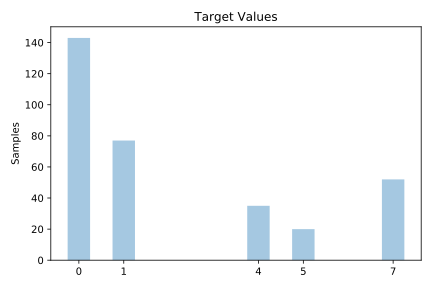
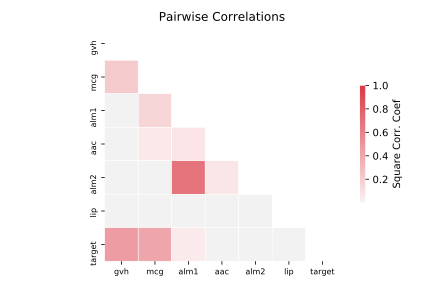

# ecoli

[Metadata](metadata.yaml) | [Summary Statistics](summary_stats.csv)

## Summary

**task**: classification

**instances**: 327

**features**: 7

**number of classes**: 7

## Summary Plots

## Data Summary

|	variable	|	count	|	mean	|	std	|	min	|	25%	|	50%	|	75%	|	max|
| --- | --- | --- | --- | --- | --- | --- | --- | --- |
|	mcg	|	327	|	0	|	0	|	0	|	0	|	0	|	0	|	0
|	gvh	|	327	|	0	|	0	|	0	|	0	|	0	|	0	|	1
|	lip	|	327	|	0	|	0	|	0	|	0	|	0	|	0	|	1
|	chg	|	327	|	0	|	0	|	0	|	0	|	0	|	0	|	0
|	aac	|	327	|	0	|	0	|	0	|	0	|	0	|	0	|	0
|	alm1	|	327	|	0	|	0	|	0	|	0	|	0	|	0	|	1
|	alm2	|	327	|	0	|	0	|	0	|	0	|	0	|	0	|	0
|	target	|	327	|	2	|	2	|	0	|	0	|	1	|	4	|	7
