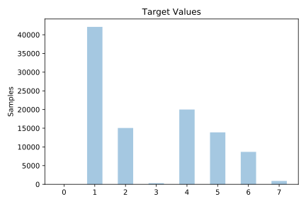
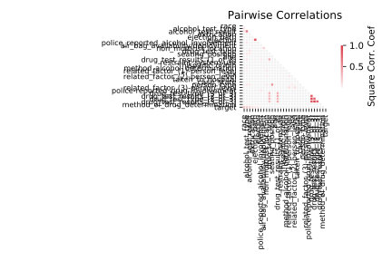

# fars

[Metadata](metadata.yaml) | [Summary Statistics](summary_stats.csv)

## Summary

**task**: classification

**instances**: 100968

**features**: 29

**number of classes**: 29

## Summary Plots

## Data Summary

|	variable	|	count	|	mean	|	std	|	min	|	25%	|	50%	|	75%	|	max|
| --- | --- | --- | --- | --- | --- | --- | --- | --- |
|	CASE_STATE	|	100968	|	23	|	15	|	0	|	9	|	22	|	38	|	50
|	AGE	|	100968	|	37	|	22	|	0	|	20	|	32	|	49	|	99
|	SEX	|	100968	|	0	|	0	|	0	|	0	|	1	|	1	|	2
|	PERSON_TYPE	|	100968	|	3	|	2	|	0	|	1	|	1	|	6	|	9
|	SEATING_POSITION	|	100968	|	5	|	4	|	0	|	3	|	3	|	6	|	25
|	RESTRAINT_SYSTEM-USE	|	100968	|	6	|	1	|	0	|	5	|	7	|	7	|	11
|	AIR_BAG_AVAILABILITY/DEPLOYMENT	|	100968	|	4	|	3	|	0	|	4	|	4	|	4	|	12
|	EJECTION	|	100968	|	0	|	0	|	0	|	0	|	0	|	0	|	3
|	EJECTION_PATH	|	100968	|	1	|	2	|	0	|	0	|	0	|	0	|	9
|	EXTRICATION	|	100968	|	0	|	0	|	0	|	1	|	1	|	1	|	2
|	NON_MOTORIST_LOCATION	|	100968	|	15	|	1	|	0	|	16	|	16	|	16	|	17
|	POLICE_REPORTED_ALCOHOL_INVOLVEMENT	|	100968	|	0	|	0	|	0	|	0	|	1	|	1	|	3
|	METHOD_ALCOHOL_DETERMINATION	|	100968	|	2	|	0	|	0	|	2	|	2	|	2	|	6
|	ALCOHOL_TEST_TYPE	|	100968	|	5	|	2	|	0	|	4	|	4	|	9	|	9
|	ALCOHOL_TEST_RESULT	|	100968	|	68	|	42	|	0	|	15	|	96	|	96	|	99
|	POLICE-REPORTED_DRUG_INVOLVEMENT	|	100968	|	1	|	0	|	0	|	2	|	2	|	2	|	3
|	METHOD_OF_DRUG_DETERMINATION	|	100968	|	2	|	0	|	0	|	3	|	3	|	3	|	4
|	DRUG_TEST_TYPE	|	100968	|	2	|	1	|	0	|	2	|	2	|	2	|	6
|	DRUG_TEST_RESULTS_(1_of_3)	|	100968	|	207	|	396	|	0	|	0	|	0	|	1	|	999
|	DRUG_TEST_TYPE_(2_of_3)	|	100968	|	2	|	0	|	0	|	2	|	2	|	2	|	6
|	DRUG_TEST_RESULTS_(2_of_3)	|	100968	|	100	|	295	|	0	|	0	|	0	|	0	|	999
|	DRUG_TEST_TYPE_(3_of_3)	|	100968	|	2	|	0	|	0	|	2	|	2	|	2	|	6
|	DRUG_TEST_RESULTS_(3_of_3)	|	100968	|	95	|	292	|	0	|	0	|	0	|	0	|	999
|	HISPANIC_ORIGIN	|	100968	|	6	|	1	|	0	|	6	|	6	|	6	|	8
|	TAKEN_TO_HOSPITAL	|	100968	|	1	|	0	|	0	|	0	|	2	|	2	|	2
|	RELATED_FACTOR_(1)-PERSON_LEVEL	|	100968	|	26	|	3	|	0	|	27	|	27	|	27	|	44
|	RELATED_FACTOR_(2)-PERSON_LEVEL	|	100968	|	28	|	2	|	0	|	29	|	29	|	29	|	47
|	RELATED_FACTOR_(3)-PERSON_LEVEL	|	100968	|	19	|	0	|	0	|	19	|	19	|	19	|	32
|	RACE	|	100968	|	12	|	3	|	0	|	11	|	11	|	15	|	17
|	target	|	100968	|	2	|	1	|	0	|	1	|	2	|	4	|	7
