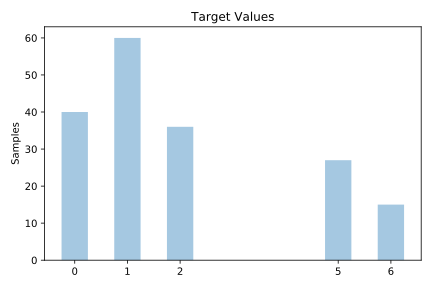
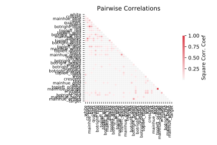

# flags

[Metadata](metadata.yaml) | [Summary Statistics](summary_stats.csv)

## Summary

**task**: classification

**instances**: 178

**features**: 43

**number of classes**: 43

## Summary Plots

## Data Summary

|	variable	|	count	|	mean	|	std	|	min	|	25%	|	50%	|	75%	|	max|
| --- | --- | --- | --- | --- | --- | --- | --- | --- |
|	target	|	178	|	2	|	1	|	0	|	1	|	1	|	2	|	6
|	bars	|	178	|	0	|	1	|	0	|	0	|	0	|	0	|	5
|	stripes	|	178	|	1	|	2	|	0	|	0	|	0	|	3	|	14
|	colors	|	178	|	3	|	1	|	1	|	3	|	3	|	4	|	8
|	red	|	178	|	0	|	0	|	0	|	1	|	1	|	1	|	1
|	green	|	178	|	0	|	0	|	0	|	0	|	0	|	1	|	1
|	blue	|	178	|	0	|	0	|	0	|	0	|	1	|	1	|	1
|	gold	|	178	|	0	|	0	|	0	|	0	|	0	|	1	|	1
|	white	|	178	|	0	|	0	|	0	|	0	|	1	|	1	|	1
|	black	|	178	|	0	|	0	|	0	|	0	|	0	|	1	|	1
|	orange	|	178	|	0	|	0	|	0	|	0	|	0	|	0	|	1
|	circles	|	178	|	0	|	0	|	0	|	0	|	0	|	0	|	2
|	crosses	|	178	|	0	|	0	|	0	|	0	|	0	|	0	|	2
|	saltires	|	178	|	0	|	0	|	0	|	0	|	0	|	0	|	1
|	quarters	|	178	|	0	|	0	|	0	|	0	|	0	|	0	|	4
|	sunstars	|	178	|	1	|	4	|	0	|	0	|	0	|	1	|	50
|	crescent	|	178	|	0	|	0	|	0	|	0	|	0	|	0	|	1
|	triangle	|	178	|	0	|	0	|	0	|	0	|	0	|	0	|	1
|	icon	|	178	|	0	|	0	|	0	|	0	|	0	|	0	|	1
|	animate	|	178	|	0	|	0	|	0	|	0	|	0	|	0	|	1
|	text	|	178	|	0	|	0	|	0	|	0	|	0	|	0	|	1
|	mainhue_green	|	178	|	0	|	0	|	0	|	0	|	0	|	0	|	1
|	mainhue_red	|	178	|	0	|	0	|	0	|	0	|	0	|	1	|	1
|	mainhue_blue	|	178	|	0	|	0	|	0	|	0	|	0	|	0	|	1
|	mainhue_gold	|	178	|	0	|	0	|	0	|	0	|	0	|	0	|	1
|	mainhue_white	|	178	|	0	|	0	|	0	|	0	|	0	|	0	|	1
|	mainhue_orange	|	178	|	0	|	0	|	0	|	0	|	0	|	0	|	1
|	mainhue_black	|	178	|	0	|	0	|	0	|	0	|	0	|	0	|	1
|	mainhue_brown	|	178	|	0	|	0	|	0	|	0	|	0	|	0	|	1
|	topleft_black	|	178	|	0	|	0	|	0	|	0	|	0	|	0	|	1
|	topleft_red	|	178	|	0	|	0	|	0	|	0	|	0	|	1	|	1
|	topleft_green	|	178	|	0	|	0	|	0	|	0	|	0	|	0	|	1
|	topleft_blue	|	178	|	0	|	0	|	0	|	0	|	0	|	0	|	1
|	topleft_white	|	178	|	0	|	0	|	0	|	0	|	0	|	0	|	1
|	topleft_orange	|	178	|	0	|	0	|	0	|	0	|	0	|	0	|	1
|	topleft_gold	|	178	|	0	|	0	|	0	|	0	|	0	|	0	|	1
|	botright_green	|	178	|	0	|	0	|	0	|	0	|	0	|	0	|	1
|	botright_red	|	178	|	0	|	0	|	0	|	0	|	0	|	1	|	1
|	botright_white	|	178	|	0	|	0	|	0	|	0	|	0	|	0	|	1
|	botright_black	|	178	|	0	|	0	|	0	|	0	|	0	|	0	|	1
|	botright_blue	|	178	|	0	|	0	|	0	|	0	|	0	|	0	|	1
|	botright_gold	|	178	|	0	|	0	|	0	|	0	|	0	|	0	|	1
|	botright_orange	|	178	|	0	|	0	|	0	|	0	|	0	|	0	|	1
|	botright_brown	|	178	|	0	|	0	|	0	|	0	|	0	|	0	|	1
