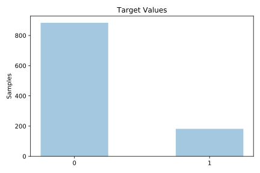

# flare

[Metadata](metadata.yaml) | [Summary Statistics](summary_stats.csv)

## Summary

**task**: classification

**instances**: 1066

**features**: 10

**number of classes**: 10

## Summary Plots

## Data Summary

|	variable	|	count	|	mean	|	std	|	min	|	25%	|	50%	|	75%	|	max|
| --- | --- | --- | --- | --- | --- | --- | --- | --- |
|	class code	|	1066	|	2	|	1	|	0	|	1	|	2	|	5	|	5
|	largest spot code	|	1066	|	2	|	1	|	0	|	2	|	4	|	4	|	5
|	spot dist code	|	1066	|	2	|	0	|	0	|	2	|	2	|	3	|	3
|	Activity	|	1066	|	1	|	0	|	1	|	1	|	1	|	1	|	2
|	Evolution	|	1066	|	2	|	0	|	1	|	2	|	2	|	3	|	3
|	Previous 24 hour code	|	1066	|	1	|	0	|	1	|	1	|	1	|	1	|	3
|	Historically-complex	|	1066	|	1	|	0	|	1	|	1	|	1	|	2	|	2
|	become complex	|	1066	|	1	|	0	|	1	|	2	|	2	|	2	|	2
|	Area	|	1066	|	1	|	0	|	1	|	1	|	1	|	1	|	2
|	Area of the largest spot	|	1066	|	1	|	0	|	1	|	1	|	1	|	1	|	1
|	target	|	1066	|	0	|	0	|	0	|	0	|	0	|	0	|	1
